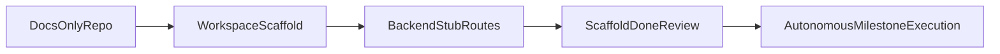

# Scaffold-First Execution Plan

## Chosen Defaults

- Frontend: Next.js (App Router) + TypeScript + Tailwind.
- Backend: Fastify + TypeScript (deploy target: Render Web Service).
- Repository layout: npm workspaces monorepo.

## Target Structure

- `apps/frontend` (Next.js UI shell)
- `apps/backend` (Fastify API shell)
- `packages/shared` (shared contracts/types)
- Root workspace files (`package.json`, workspace scripts, base TS config)

## Phase 1: Workspace Scaffold (No Business Logic)

- Create root npm workspace config with scripts for dev/build/typecheck/test across apps.
- Add base TypeScript strict config and per-package TS configs.
- Initialize frontend app with minimal mission shell pages/routes and environment placeholders.
- Initialize backend app with Fastify server bootstrap, health route, and typed route registration pattern.
- Initialize `packages/shared` with contract types used by both frontend/backend.

## Phase 2: Backend API Skeleton (Stub Routes Only)

- Add route stubs matching PlatformClient surface:
  - `POST /api/missions/start`
  - `POST /api/missions/decision`
  - `POST /api/mentor/invoke`
- Return deterministic placeholder payloads conforming to shared types (no real scoring logic yet).
- Add error envelope and typed validation boundaries for future contract parity work.

## Phase 3: Scaffold Readiness Gate (Manual Review Checkpoint)

- Verify local commands run from root (`dev`, `build`, `typecheck`, basic tests).
- Verify frontend can call backend stubs via configured base URL.
- Verify shared contracts compile in both apps.
- Review checklist outcome: mark **Scaffold Done** before autonomous milestone execution.

## Phase 4: Autonomous Milestone Execution Hand-off

- Start agent execution from `Pre_Build Documents/00_Program_Control/MASTER_KICKOFF_PROMPT.md`.
- Instruct agents to begin at milestone slices that require contract parity only after scaffold gate passes.
- Require QA evidence and design credibility checks per milestone definitions.

## File-Level Deliverables

- Root: `package.json`, workspace scripts, `tsconfig.base.json`, lint/test configs.
- Frontend: Next.js app entry, base layout/page(s), API client stub wiring.
- Backend: Fastify bootstrap, route modules, schema/type glue.
- Shared: mission/request/response interfaces and error model placeholders.
- Ops: `.env.example` files for frontend/backend and minimal Render/Vercel deployment notes.

## Acceptance Criteria

- Repo transitions from docs-only to runnable scaffold.
- Frontend + backend + shared compile under strict TypeScript.
- Backend contract stub routes respond with typed payloads.
- Scaffold review checkpoint completed before autonomous agents continue.

