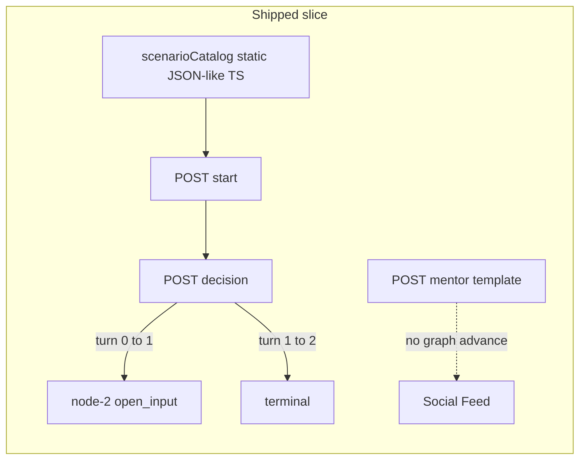
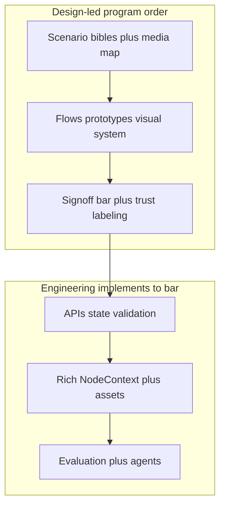

# V2 UX assessment and path to a real simulation

## Operating model: design and UX lead; tech follows

**Priority shift (explicit):** We do **not** shrink scenarios to fit whatever the last tech slice happened to implement. **Product, design, and multimedia exploration set the target experience**—including what would be unacceptable to a designer, marketer, or PM (thin MCQ spine, fake “mentor,” length-based scoring posing as competence). **Engineering’s job** is to **close the gap** to **signed artifacts** (scenario bibles, flows, prototypes, content specs), with clear boundaries: learner-facing certification credibility is a **design and governance** obligation, not an afterthought.

**Who leads what**

- **Business / domain SMEs:** scenario truth—stakes, constraints, and what “good” looks like in real TI work.
- **Design + multimedia:** pacing, channels (text, document fragments, messaging UI, audio/storyboard where relevant), mood, accessibility, and the **feel** of the mini-world; brainstorm formats that break out of “two buttons and a textarea.”
- **Product:** scope, success metrics, and **what we refuse to ship** without quality.
- **Tech:** state, APIs, validation, persistence, LLM where it serves the authored experience—**after** the experience intent is frozen enough to implement without constant rewrites.

**Trust:** Treat prior “vertical slices” that over-promised as **trust debt**. Any public or cert-adjacent surface should be labeled honestly until design-led criteria are met.

---

## Product principle: scenario as mini-world (not a golden path)

A **scenario** is **guidance for a small world**: broad context, constraints, and cast—not a linear test with one correct sequence. While the user plays, they should meet **both** expected (authored) situations **and** **unexpected** ones that **change** how the run unfolds (new pressure, new information, a stakeholder flip, a timebox, a leaked detail). That makes a scenario a **short adventure**: multiple reasonable ways to navigate it, tradeoffs instead of a single “right” click, and outcomes that differ by how they handled ambiguity—closer to real work than “pick A or B.”

**Implications for implementation** (these override “thin graph” habits):

- **No certification story that collapses to one golden path** or to **1–2 binary gates** as the spine; binary forks may exist as **flavor or routing**, not as the only expression of competence.
- **Authored content** supplies *setting, roles, risks, and beat types*; **runtime** supplies *which beats fire, when, and with what twist* (seed, profile, prior turns, randomness within guardrails).
- **Success** is defined by **rubric-relevant behavior** across the run (evidence, judgment, communication), not by matching a hidden canonical branch sequence.

The sections below on gaps and remediation are measured against this principle, not against “more nodes in a straight line.”

---

## What you experienced vs what the repo actually does

Your reaction is aligned with the **current implementation**, not with the richer behavior described in [Pre_Build Documents](Pre_Build%20Documents/03_Architecture_and_Product/02_Product_and_Scenarios/SCENARIOS.md) and [SESSION_AND_NODE_STATE_MACHINE.md](Pre_Build%20Documents/02_Contracts/01_API_and_State/SESSION_AND_NODE_STATE_MACHINE.md). The codebase is effectively a **wiring demo**: API contracts, session persistence, and a sparse UI—not an adaptive simulation yet.

---

### 1) Scenario narrative (short, simplistic, confusing MCQ)

**Evidence**

- All narrative and both branching labels live in a **single static object** in `[apps/backend/src/scenarioCatalog.ts](apps/backend/src/scenarioCatalog.ts)`. Every user who starts `scenario-1` gets the same `sceneText` and the same two `branchingOptions`.
- On mission start, the server loads `profileMetrics` from persistence but **does not use them** to change copy, options, or difficulty—the start node is always `node-1` from that catalog (`[app.ts` start handler](apps/backend/src/app.ts) ~L186–215).

So the story feels “thin” because there is **only one authored beat** before the open-input node, and no personalization layer exists in code.

---

### 2) Multiple choice: not dynamic; two options; weak signal

**Evidence**

- First step is `type: 'branching'` with **exactly two** options (hardcoded).
- Progression is **linear by turn count**, not by choice: after any branching submission, the next node is always `node-2` (`nextId = \`node-${nextTurnId + 1}`, terminal after` nextTurnId >= 2`) in [`app.ts` decision handler](apps/backend/src/app.ts) ~L434–454. **Both branches lead to the same next scene.**
- Branching turns do not run the evaluation engine; only open-input turns do. XP/profile bumps are largely **uniform** (+5 totalXP, +2 FOUNDATIONS) regardless of which button you pick (~L420–426).

Your concern about **low credibility and high bias** for certification is valid for this slice: the MCQ is **positional noise** for the graph today, not a measured competency signal.

---

### 3) “Locking” and same question for everyone

**What is actually “locked”**

- **Idempotency**: `clientSubmissionId` + caching avoids double-submit replay (`[getCachedDecision](apps/backend/src/app.ts)`). That is not “one question for the world,” it is per-submission deduplication.
- **Content**: The uncomfortable truth is the opposite of what you want for a simulation product: **all clients do see the same scripted node** from `[scenarioCatalog.ts](apps/backend/src/scenarioCatalog.ts)` until a generation or CMS layer exists.

If a prior agent implied “locking” means everyone shares one global question set, the **content part is accurate** today; the **caching part** is a normal API pattern and unrelated to fairness of assessment.

---

### 4) Mentor / dialog: when it happens, why it feels hollow

**Evidence**

- Mentor runs **only** on explicit UI action: `[invokeMentor](apps/frontend/src/lib/missionStore.ts)` → `POST /api/missions/mentor`. There is **no** proactive Crowd, no scheduled mentor moment, no chat thread in the frontend.
- The “hint” is **not** an LLM call. The response text is **hardcoded** in `[app.ts](apps/backend/src/app.ts)` ~L655–662 (`Mentor hint: start with your decision…` or a short template if `challengeText` is sent—which the current store does not pass).

So it cannot feel like V1’s static mentor if V1 had authored tone; this is **placeholder UX** with spec-shaped API surface.

---

### 5) “Scenario” and immersion (your definition vs shipped)

| Your intent (from message)                 | Shipped product                                                                                                                                                                                                         |
| ------------------------------------------ | ----------------------------------------------------------------------------------------------------------------------------------------------------------------------------------------------------------------------- |
| Immersive, blending reality and simulation | Single column of text + side “Social Feed” list on `[page.tsx](apps/frontend/src/app/page.tsx)`                                                                                                                         |
| Dynamic, evolving, adapting                | Static catalog; **no** DDA in runtime ([docs claim DDA](Pre_Build%20Documents/03_Architecture_and_Product/02_Product_and_Scenarios/DYNAMIC_DIFFICULTY_ADJUSTMENT.md), **code does not inject tier/persona into nodes**) |
| Meaningful open-text assessment            | `[server.ts](apps/backend/src/server.ts)` wires `[DeterministicEvaluationEngine](apps/backend/src/evaluator.ts)`: score scales with **textarea length** (~`trim().length / 200`), not rubric quality                    |

So when you say “1980s computer,” you are describing **accurately**: the shell is a **state machine renderer**, not an ambient simulation.

---

## Architecture snapshot (as implemented)

---

## Remediation direction (design first, then engineering)

**Phase A — Creative and product (blocking)**

1. **Pilot scenario bibles** (todo `design-led-scenarios`): a small set of **real business** situations with cast, stakes, expected + surprise beats, artifact list (what the learner “sees”: emails, slides, chat threads, etc.), and **rubric intent** (what competence is being evidenced—not MCQ trivia).
2. **UX signoff bar** (todo `ux-signoff-bar`): agreed minimum for learner-facing quality; reference `[V2_SCENARIO_AMBIENCE_AND_MOOD_SPEC.md](Pre_Build%20Documents/02_Contracts/06_Design_Authority/V2_SCENARIO_AMBIENCE_AND_MOOD_SPEC.md)` and extend with **multi-channel** patterns from the brainstorm—not a retrofit around a default form layout.
3. **Honest labeling** (todo `truth-table`): internal/stakeholder clarity on what shipped code is today vs what the bibles require—reduces repeat trust damage.

**Phase B — Engineering (implements Phase A outputs; does not redefine scope)**

1. **Interactivity model** — Implement the **graph and beats** the bible specifies: **multiple viable routes**, emergent beat layer (todo `emergent-beats`), open-input-first scoring surface; MCQ only where design places it, with consequence—not as the default spine because it was easy to code.
2. **Content and variation** — Parameterization and/or generation **as specified in the bible** (todo `variation-layer`); Zod at boundaries per project rules.
3. **Mentor and social layer** — Only in forms that match `AGENT_RUNTIME_SPEC` **and** the designed dialogue UX (todo `llm-eval-mentor`); no placeholder strings in learner paths.
4. **Evaluation** — Rubric-credible engine replacing length proxies (todo `llm-eval-mentor` / evaluator work); no cert claims until aligned with design-approved rubrics.
5. **Immersion UI** — Ship to the signed visual and structural spec (todo `ux-immersion`); backend extends `NodeContext` (and asset references) to carry what design authored.

---

## Success criteria (concrete)

- Starting the same `scenarioId` twice (or two users) produces **meaningfully different** readable setup (names, numbers, constraints), or clearly labeled **difficulty tier**.
- A full run includes **at least one unexpected beat** (or clearly traceable stochastic/conditional injection) that **alters** what the user must address—not merely a static paragraph order.
- **Multiple viable paths** exist: different reasonable choices lead to **different** intermediate pressure and/or ending dossier signals, without one mandatory sequence.
- No **pure** 50/50 binary MCQ as the **only** scored gate; open text (or multi-part structured response) is the **default** assessment surface.
- Mentor is **opt-in with optional reply**, LLM-generated, grounded in current `NodeContext`, and auditable in events.
- Open-input scores reflect **rubric alignment**, not string length.

---

## Note on planning vs delivery

The pre-build corpus describes a **large** platform; the repo’s mission path is a **small** subset. The gap is not “you misread the vision”—it is **implementation depth**. Closing it is a **content + orchestration + UI** program, not a single endpoint tweak.