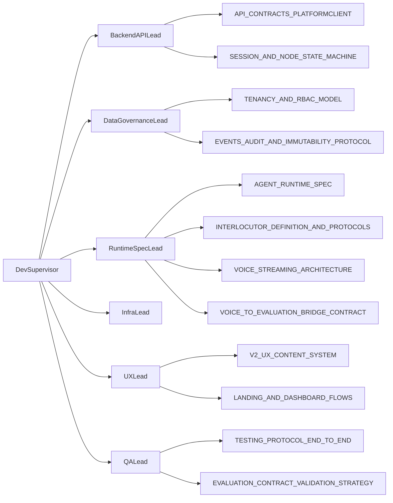

# Agent Team Topology (Dev)

This document defines how “multiple agent leads running in parallel” should collaborate so they share the same contracts, avoid rework, and produce consistent artifacts that other agents can integrate.

It is inspired by your architecture intent:
- backend is the enterprise choke point
- explicit contracts define integration boundaries
- immutable event lake enables auditability

## Recommended roles (agent leads)

### Dev Supervisor (orchestrator)
Owns:
- overall dependency graph of docs and implementation tasks
- acceptance checks that each contract is satisfied
- the “integration canvas”: links from docs → acceptance criteria → test plans

Communicates:
- publishes integration milestones
- resolves conflicts in endpoint naming, state transitions, and schema mapping

### Backend API Lead
Owns:
- implementing the endpoints described in `API_CONTRACTS_PLATFORMCLIENT.md`
- enforcing idempotency and state-machine consistency from `SESSION_AND_NODE_STATE_MACHINE.md`
- mapping API payloads to the evaluation & persistence layers

### Data Governance Lead
Owns:
- tenancy and RBAC enforcement described in `TENANCY_AND_RBAC_MODEL.md`
- immutable event lake enforcement described in `EVENTS_AUDIT_AND_IMMUTABILITY_PROTOCOL.md`
- anonymization rules and failure-event strategy

### Runtime Spec Lead (Mission + Social Engine + Voice)
Owns:
- `AGENT_RUNTIME_SPEC.md` and `INTERLOCUTOR_DEFINITION_AND_PROTOCOLS.md` contracts
- voice transport and transcript policy via the voice docs
- consistent tool boundaries (deterministic vs LLM-backed behavior)

### Infra/Platform Lead (Render/Vercel)
Owns:
- environment variable strategy (keys and secrets handling)
- runtime constraints and CORS/network boundaries
- any provider integration notes required by the test protocol

### UX/Scenario Lead
Owns:
- `V2_UX_CONTENT_SYSTEM.md` and `LANDING_AND_DASHBOARD_FLOWS.md` design system mapping
- ensures the UI uses only `MissionState/NodeContext` from backend
- verifies storyline compatibility with node graph and DDA tiering

### QA/Test Lead
Owns:
- `TESTING_PROTOCOL_END_TO_END.md` and `EVALUATION_CONTRACT_VALIDATION_STRATEGY.md`
- E2E suite acceptance criteria and deterministic mocking policies

### Security/Compliance Lead (lightweight but explicit)
Owns:
- verifying no cross-tenant access patterns
- confirming secrets never leak into client logs or insecure places
- reviewing event immutability enforcement posture

## Artifact ownership and handoffs

Define “handoff contracts” as:
- a doc link
- a set of acceptance checks
- example payloads or schema snippets

Handoff sequence (suggested):
1. Backend API + state machine docs produced and stable
2. Governance docs produced and stable
3. Runtime spec docs produced and stable
4. Voice bridge contract produced and stable (so QA can mock)
5. Admin/tracker docs produced once data shape is locked
6. UX docs produced once node schema and terminal state are stable
7. Testing + observability docs produced once endpoints and failure behaviors are stable

## Collaboration map (for clarity)

## Change management rules
- Contract changes require:
  - updating the owning doc
  - updating the dependent doc(s)
  - adding/adjusting E2E mocks
- Never “patch” contract behavior only in code—if behavior changes, the contract doc must change first.

