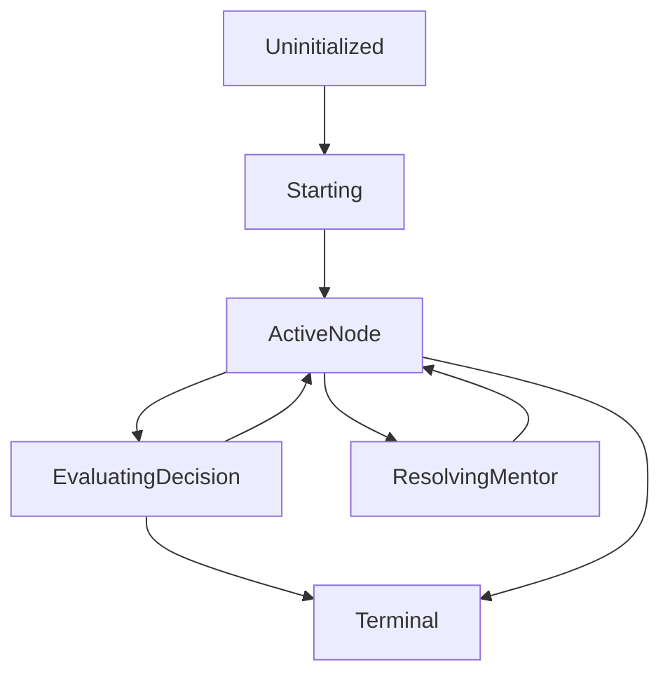

# Session + Node State Machine

This doc specifies the mission session state transitions the backend must enforce so the frontend UI can remain a deterministic renderer of `NodeContext`.

It is aligned with:
- `FULL_FINAL_BLUEPRINT.md` (decoupled stack, branching + open input)
- `API_CONTRACTS_PLATFORMCLIENT.md` (explicit idempotency and endpoint responsibilities)

## Core entities

### Session
- Created by `POST /api/missions/start`
- Owns:
  - `sessionId`
  - the current “live” `nodeId`
  - a turn counter (`turnId`)
  - any session-scoped metadata needed for evaluation (persona, DDA tier routing, etc.)

### NodeContext
- The backend-produced payload the UI renders as:
  - scenario narrative
  - tool inputs / choice options
  - any “current challenge” text (for open input)

### Turn
- One user interaction that targets a specific node:
  - branching choice turn
  - open input turn
  - mentor invocation turn (hinting)
- Each turn uses a `clientSubmissionId` for idempotency.

## State machine (high-level)

### Meaning of states
- `Uninitialized`:
  - No session exists yet in persistence.
- `Starting`:
  - Backend validates scenario access and creates `sessionId`.
- `ActiveNode`:
  - The UI is allowed to render `currentNode` and accept input for that node.
- `EvaluatingDecision`:
  - Backend validates input semantics, runs deterministic resolution or LLM scoring (for open input), updates `/profiles`, and appends to `/events`.
- `ResolvingMentor`:
  - Backend runs the social-engine hinting logic (soft guardrails) and returns a hint payload without advancing the node graph.
- `Terminal`:
  - The backend has determined the session is complete; the UI should render the terminal dossier/summary view.

## Transition rules (must be enforced server-side)

### Start mission
1. Validate `scenarioId` is enabled for the resolved `tenantId`.
2. Create a new `sessionId`.
3. Initialize:
   - `turnId = 0`
   - `currentNode` (including DDA tier selection if node supports adaptive behavior)
4. Respond with a full `MissionState`.

### Submit decision
1. Validate `sessionId` is valid and belongs to the resolved `tenantId`.
2. Validate `nodeId` equals the session’s current `currentNode.nodeId`.
3. Enforce concurrency:
   - for a given `sessionId` and current node, only one decision turn can be “in flight”
4. Enforce idempotency:
   - if `(sessionId, nodeId, clientSubmissionId)` was already processed:
     - return the previously computed outcome deterministically
5. Resolve:
   - Branching: apply deterministic effects and select next node.
   - Open input: run LLM evaluation using the strict JSON contract.
6. Persist:
   - update `/profiles` competency metrics
   - append a tenant-scoped anonymized record to `/events`
7. Increment `turnId` and return updated `MissionState`.

### Terminal determination
- Terminal can be reached by:
  - a scenario’s node graph end node
  - a negative guardrail termination rule (if implemented as a deterministic rule in the orchestrator layer)
- When `isTerminal=true`:
  - further `submitDecision` calls must be rejected with an error code like `SESSION_TERMINAL`.

## Persistence model (suggested)

### `/sessions` (session runtime snapshot)
Store enough to rebuild UI without requiring expensive recomputation:
- `tenantId`
- `sessionId`
- `nodeId`
- `turnId`
- `isTerminal`
- any routing/selection needed to keep the session consistent (e.g., DDA tier chosen at start).

### `/events` (immutable append-only evaluation records)
Store every evaluation event required for:
- admin audit
- future reprocessing / analytics
- “event lake” replay

Immutability requirement (operationalized in a separate governance doc):
- no updates after append
- only creates

## Retry / replay safety (edge cases)
- Duplicate submissions:
  - do not double-apply XP/metrics
  - return the same next `MissionState`
- Out-of-order delivery:
  - reject submissions for a node that is not the session’s current node
- Partial failures:
  - if LLM call succeeds but persistence fails, do not commit a “next node” without persistence.
  - prefer transactional patterns or “write then respond” discipline with a correlation id.

## Voice integration touchpoint
Voice is treated as an input transport:
- A voice turn produces `transcriptText` (and optional timing metadata).
- That transcript is evaluated via the same `submitDecision` endpoint using the same state-machine transition rules.

Voice streaming details are defined in:
- `VOICE_STREAMING_ARCHITECTURE.md`
- `VOICE_TO_EVALUATION_BRIDGE_CONTRACT.md`

