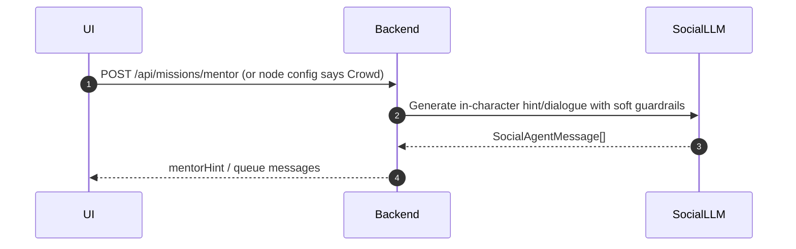

# Agent Runtime Spec (Mentor, Crowd, Roaming, Voice Interlocutors)

This document specifies how in-app “agents” behave at runtime.

Key principle:
- The **backend** decides *when* an agent triggers and *what* mission context it uses.
- The “agent outputs” are **UI-renderable messages** and optional **hint metadata**.
- The backend applies **certification scoring** only via the strict open-input evaluation contract (see `LLM_ORCHESTRATOR_PROMPT_ARCHITECTURE.md` and `API_CONTRACTS_PLATFORMCLIENT.md`).

## Deterministic vs LLM-backed responsibilities

### Deterministic responsibilities (backend)
- Enforce scenario node type:
  - branching effects vs open-input evaluation
- Enforce state-machine invariants (session/node/turn correctness)
- Decide agent triggers based on:
  - node configuration
  - profile-driven DDA tier routing
  - user actions (choice submitted vs voice transcript confirmed)
- Persist event/audit entries (using append-only governance rules)

### LLM-backed responsibilities (social flavor + voice output)
- Generate in-character dialogue for:
  - Mentor
  - The Crowd
  - Office Roaming NPCs
- When voice is enabled:
  - drive the live audio experience (two-way audio transport)

What the LLM output must *not* do:
- It must not directly mutate `/profiles` without going through the strict certification scoring pipeline.
- It must not bypass the state machine (no node graph changes without backend validation).

## Agent output contracts (UI-facing)

Agents return “messages” that the frontend renders as a queue (like `activeSocialQueue` in the existing Zustand concept).

### `SocialAgentMessage` (suggested)
```ts
interface SocialAgentMessage {
  id: string;
  interlocutorId: string; // e.g. "Mentor", "Crowd", "OfficeRoamer_3"
  role: 'npc' | 'system';
  text: string; // in-character output to render
  toneHint?: string; // optional: for UI formatting/animation only
  createdAt: string; // ISO timestamp
  // If true, UI may end the “social” segment (but not the mission unless terminal)
  shouldStop?: boolean;
  // Optional: hint metadata for special UI components
  hint?: {
    challengeContext?: string;
    guidanceText: string;
  };
}
```

## Agent: Mentor (on-demand guidance)

### Trigger conditions
- UI requests Mentor via `POST /api/missions/mentor`.
- Backend may include:
  - current node narrative context
  - user’s most recent attempt (text or transcript)
  - DDA tier modifiers (hostility/support style)

### Runtime behavior
- Mentor generates:
  - a short Socratic hint
  - optional targeted clarification questions
- Mentor must follow the “soft guardrails” intent:
  - stay in character
  - if the user’s input is off-brief, end the hint and return to “work mode”

### Persistence
- Recommended:
  - log mentor interactions as optional events for admin replay.

## Agent: The Crowd (meeting-style pressure)

### Trigger conditions
- Node configuration requests a Crowd sequence, typically during:
  - open-input nodes
  - or after a branching choice that sets “stakeholder pressure”

### Runtime behavior
- Generate a single LLM call that produces a sequential dialogue plan.
- UI renders as:
  - a fixed ordering
  - with optional micro-pauses (pure UX; no authority)
- Crowd output should:
  - be skeptical / baiting depending on DDA tier
  - keep the user focused on the brief

### Scoring tie-in
- Crowd dialogue should influence **prompt context** for the eventual user evaluation (via backend prompt assembly).
- Crowd dialogue itself does not directly write to `/profiles`.

## Agent: Office Roaming (ambient “informal intel”)

### Trigger conditions
- Time-based or interaction-based triggers from the node config:
  - “After 20 seconds of idle”
  - “After the first user submission”
  - “When user toggles mentor off”

### Runtime behavior
- Roaming NPC:
  - checks if the user is on-topic
  - if off-topic, excuses itself (terminates its dialogue segment)
  - if on-topic, provides informal intel that nudges strategy

### Scoring tie-in
- Roaming intel should be included in the next evaluation prompt context (so it can affect what the user chooses to write/submit).

## Voice-enabled Interlocutors (streaming/live dialogue)

Voice introduces an additional “transport layer”:
- **Gemini live session** (frontend) provides two-way audio and (optionally) tool-based persona learning.
- **Mission evaluation** remains backend-owned.

### Trigger policy
- Interlocutors trigger either:
  - by node config (same as text social engine)
  - or by voice mode events (e.g., “user said a full turn; confirm transcript”)

### Transcript-to-decision bridging
- When the voice turn is confirmed (end-of-turn boundary), frontend provides:
  - transcriptText
  - metadata describing timing boundaries
- Backend evaluates the transcript using the same `submitDecision` semantics as open-input evaluation.

Voice-specific UX must handle:
- interruptions (voice agent stops talking)
- partial transcripts (do not trigger evaluation until confirmed)

## Minimal sequence flow (text social engine)



