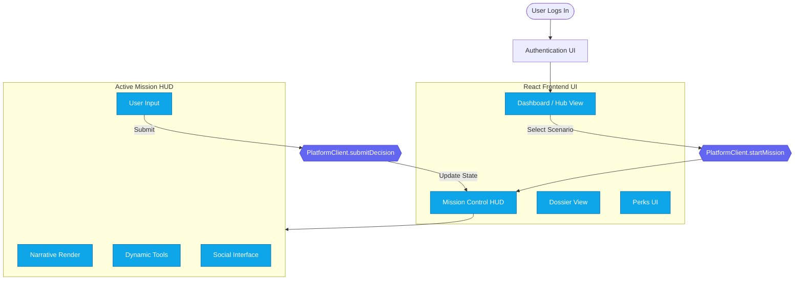
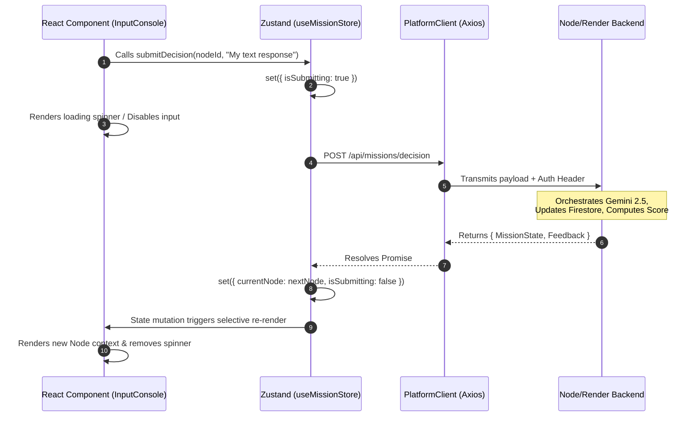
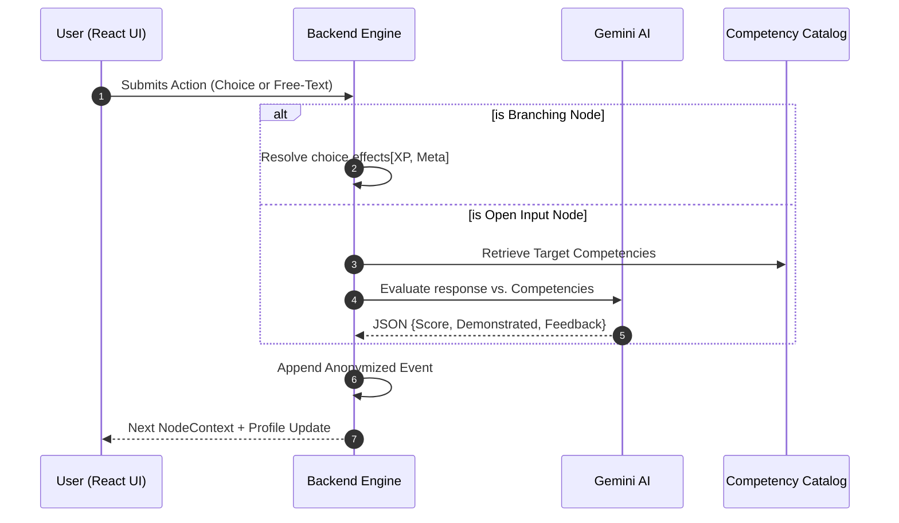
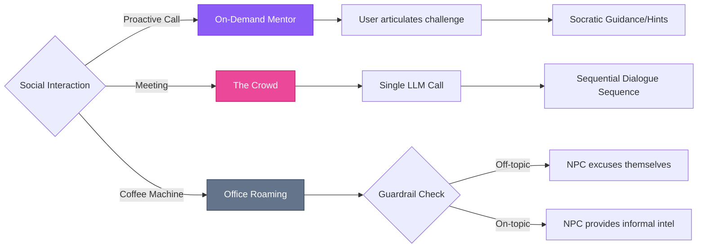
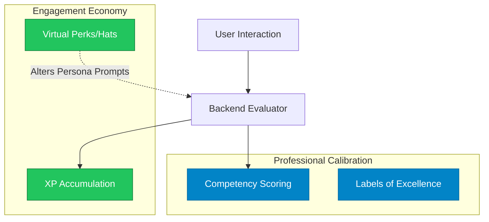

# TIC Trainer V2: Final Master Architecture & Implementation Narrative

This document serves as the authoritative blueprint for the TIC Trainer V2 platform. It provides the strategic context, technical specifications, and visual logic flows required for an Agent IDE (like Cursor) or a senior engineering team to execute the build or take over mid-flight.

---

## TI Training & Certification
**What it is:** TIC Trainer V2 is an immersive, AI-driven scenario simulation and continuous certification platform built for Talent Intelligence (TI), Workforce Planning, and People Analytics professionals. It acts as a high-stakes "Mission Control" environment rather than a passive learning module.

- **Supporting (Value):** The platform calibrates and elevates decision-making quality under pressure by forcing users to navigate conflicting stakeholder demands, data integrity dilemmas, and ethical flashpoints.
- **For Practitioners:** Builds strategic judgment and provides a persistent record of validated excellence.
- **For Enterprise Leaders:** Provides a quantified, evidence-based map of team capabilities and organizational readiness.

**Methodology:** Users navigate RPG-like missions where every decision is evaluated by a multimodal AI (Gemini 2.5) against a rigorous **TI Competency Catalog**. Value is captured via an anonymized, append-only event stream, translating gameplay into professional certification.

---

## System Architecture: The Decoupled Stack
V2 enforces a strict decoupled stack to ensure security and scalability. The client-heavy Firebase coupling of V1 is abandoned.

- **Frontend (Visual Console):** React 18+ / TailwindCSS. Holds zero authoritative simulation state.
- **Backend API (Simulation Engine):** Node.js/TypeScript. The single source of truth for mission state, LLM orchestration, and database logic.
- **Persistence:** Firestore (or equivalent NoSQL), partitioned by `tenantId`.

### The Decoupled Frontend Logic



### IDE Implementation Details: The PlatformClient Boundary
The frontend interacts exclusively with the backend via this interface. Direct database calls from the UI are prohibited.


```TypeScript

interface PlatformClient {
  startMission(request: StartMissionRequest): Promise<MissionState>;
  submitDecision(request: DecisionRequest): Promise<MissionState>;
  invokeMentor(request: MentorRequest): Promise<MentorResponse>;
}

interface MissionState {
  sessionId: string;
  currentNode: NodeContext;
  profileMetrics: ProfileMetrics;
  isTerminal: boolean;
}

```

---

## Backend API & Data Layer
The backend acts as the "Enterprise Choke Point," managing multi-tenancy and stripping PII before data hits the event lake.



---

## Interaction Model: Hybrid SDL (Branching + Open Input)
V2 supports traditional choices alongside free-text reasoning evaluated against the Competency Catalog.



IDE Implementation Details: Node Schema

```TypeScript
interface ScenarioNode {
  id: string;
  type: 'branching' | 'open_input';
  sceneText: string;
  openInputConfig?: {
    targetCompetencies: string[]; // e.g. ['ti_data_integrity', 'ti_stakeholder_mgmt']
    evaluationPrompt: string; 
  };
}
```
---

## The Agentic Social Engine
The "Real-Life Effect" is achieved by orchestrating NPCs to behave like real stakeholders with distinct social behaviors and soft guardrails.



### IDE Implementation Details: Soft Guardrails

```TypeScript
const SOFT_GUARDRAIL_PROMPT = `
You are a corporate NPC. If the user's input strays from the core TI brief or lacks conciseness, 
you must abruptly but professionally excuse yourself to return to work. Terminate the conversation.
`;
```

---

## The Dual-Track Value Economy
Decoupling "Fun" from "Serious" metrics prevents gamification fatigue while allowing for lighthearted engagement.



### IDE Implementation Details: Cosmetic Injection
function buildPersonaPrompt(basePrompt: string, profile: UserProfile): string {

```TypeScript
let prompt = basePrompt;
  if (profile.engagement.activeCosmetics.includes('virtual_ti_hat')) {
    prompt += `\nNote: The user is wearing a ridiculous virtual hat. Casually poke fun at it once.`;
  }
  return prompt;
}
```
---

## Enterprise Readiness & Phased Rollout
V2 (Current Build - Foundation):
- Tenant Isolation: All records tagged with tenantId.
- PII Segregation: Identity stored in isolated table; Events are anonymized.
- API Gateway: Single choke point for all logic to support future auditing.

V2.1 (Future Build - Features):
- Identity: SSO / SAML / Okta.
- Integrations: LMS (Workday/Degreed) via xAPI/SCORM.
- Analytics: Admin Dashboards and Cohort Heatmaps.

## Contract Docs (read before coding)
The sections below are the “implementation contracts” that multiple agent leads should treat as source-of-truth:

- Frontend <-> Backend interface: [`API_CONTRACTS_PLATFORMCLIENT.md`](../../02_Contracts/01_API_and_State/API_CONTRACTS_PLATFORMCLIENT.md)
- Mission session + node state machine rules: [`SESSION_AND_NODE_STATE_MACHINE.md`](../../02_Contracts/01_API_and_State/SESSION_AND_NODE_STATE_MACHINE.md)
- Tenancy isolation and RBAC: [`TENANCY_AND_RBAC_MODEL.md`](../../02_Contracts/02_Data_Governance/TENANCY_AND_RBAC_MODEL.md)
- Immutable, anonymized event lake: [`EVENTS_AUDIT_AND_IMMUTABILITY_PROTOCOL.md`](../../02_Contracts/02_Data_Governance/EVENTS_AUDIT_AND_IMMUTABILITY_PROTOCOL.md)
- In-app agent runtime behavior (Mentor/Crowd/Roaming): [`AGENT_RUNTIME_SPEC.md`](../../02_Contracts/03_Runtime_and_Voice/AGENT_RUNTIME_SPEC.md)
- Interlocutor trigger/protocol rules: [`INTERLOCUTOR_DEFINITION_AND_PROTOCOLS.md`](../../02_Contracts/03_Runtime_and_Voice/INTERLOCUTOR_DEFINITION_AND_PROTOCOLS.md)
- Voice streaming transport + interruption policy: [`VOICE_STREAMING_ARCHITECTURE.md`](../../02_Contracts/03_Runtime_and_Voice/VOICE_STREAMING_ARCHITECTURE.md)
- Voice transcript turn bridge into mission evaluation: [`VOICE_TO_EVALUATION_BRIDGE_CONTRACT.md`](../../02_Contracts/03_Runtime_and_Voice/VOICE_TO_EVALUATION_BRIDGE_CONTRACT.md)
- Admin + tracker requirements: [`ADMIN_DOMAIN_SPEC.md`](../../02_Contracts/04_Admin_and_Tracker/ADMIN_DOMAIN_SPEC.md), [`TRACKER_USER_AND_ADMIN_SPEC.md`](../../02_Contracts/04_Admin_and_Tracker/TRACKER_USER_AND_ADMIN_SPEC.md)
- Testing protocol + strict evaluation contract validation: [`TESTING_PROTOCOL_END_TO_END.md`](../../02_Contracts/05_Testing_and_Observability/TESTING_PROTOCOL_END_TO_END.md), [`EVALUATION_CONTRACT_VALIDATION_STRATEGY.md`](../../02_Contracts/05_Testing_and_Observability/EVALUATION_CONTRACT_VALIDATION_STRATEGY.md)
- Observability + cost/timeout guardrails: [`OBSERVABILITY_AND_GUARDRAILS.md`](../../02_Contracts/05_Testing_and_Observability/OBSERVABILITY_AND_GUARDRAILS.md)
- Design authority (UI/UX + RPG immersion contracts):
  - Credibility gate: [`V2_DESIGN_PRINCIPLES_AND_CREDIBILITY_CONSTRAINTS.md`](../../02_Contracts/06_Design_Authority/V2_DESIGN_PRINCIPLES_AND_CREDIBILITY_CONSTRAINTS.md)
  - Microcopy + tone rules: [`V2_MICROCOPY_AND_TONE_GUIDE.md`](../../02_Contracts/06_Design_Authority/V2_MICROCOPY_AND_TONE_GUIDE.md)
  - Tokens + layout constraints: [`V2_DESIGN_SYSTEM_TOKENS_AND_LAYOUT_RULES.md`](../../02_Contracts/06_Design_Authority/V2_DESIGN_SYSTEM_TOKENS_AND_LAYOUT_RULES.md)
  - Skin + Frame safety: [`V2_UI_VARIATION_CONTRACT.md`](../../02_Contracts/06_Design_Authority/V2_UI_VARIATION_CONTRACT.md)
  - Value moments: [`V2_VALUE_MOMENTS_SPEC.md`](../../02_Contracts/06_Design_Authority/V2_VALUE_MOMENTS_SPEC.md), [`V2_VALUE_MOMENT_TO_EVENT_MAPPING.md`](../../02_Contracts/06_Design_Authority/V2_VALUE_MOMENT_TO_EVENT_MAPPING.md)
  - Scenario ambience: [`V2_SCENARIO_AMBIENCE_AND_MOOD_SPEC.md`](../../02_Contracts/06_Design_Authority/V2_SCENARIO_AMBIENCE_AND_MOOD_SPEC.md)
  - Voice UI + sound design: [`V2_VOICE_UI_AND_SOUND_DESIGN_SPEC.md`](../../02_Contracts/06_Design_Authority/V2_VOICE_UI_AND_SOUND_DESIGN_SPEC.md)
  - Designer workflow governance: [`DESIGN_AGENT_WORKFLOW.md`](../../00_Program_Control/DESIGN_AGENT_WORKFLOW.md)


