# 13 SCENARIO IMPORTED FROM V1 (ADAPTED) + 8 NEW SCENARIOS


## 1. The Assessment Mechanism (Applies to all scenarios)
Because the platform relies on the Node/TS Backend Engine orchestrating Gemini 3 Flash, every open input is scored not as a simple pass/fail, but as a JSON payload containing {Score, Demonstrated, Feedback}. This feeds directly into the Profile Metrics, allowing the platform to adjust the complexity of future scenarios. 

For instance, if a user maxes out the "Data Integrity" competency in Scenario 5, Scenario 6 will dynamically prompt the NPCs to use more obfuscated, complex data sets to test the upper limits of that skill.

---

## 2. Dynamic Difficulty Adjustment (DDA) Engine
To prevent the platform from feeling like a static, "level-locked" courseware product, TIC Trainer V2 employs a Dynamic Difficulty Adjustment (DDA) model. While scenarios have a baseline difficulty, their cognitive load, NPC hostility, and data complexity scale dynamically based on the user's validated ProfileMetrics.

That means a scenario is not a single, fixed and sequential story line followed by a test; it becomes a narrative chassis that adapts to the player characteristics, current level, and platform usage histort.

### a. How it Works in Practice
When a user launches a scenario, the Backend Engine queries their current competency levels, relevant characteristics, and platform usage history. If a user "Analyst" (Level 2) and a user "Director" (Level 6) both launch a public speaking scenario (e.g., The External Keynote), the narrative skeleton remains identical, but the LLM Orchestrator dynamically swaps the internal node configuration:

- For the Level 2 User: The AI populates the audience with friendly internal stakeholders. The core challenge focuses on clear communication and baseline data translation.
- For the Level 6 User: The engine upgrades the adaptiveTiers parameters. The audience is now populated with hostile industry journalists and competitors attempting to reverse-engineer proprietary data. The core challenge shifts completely to OPSEC, executive presence, and crisis evasion.

### b. Benefits
- This prevents the "content treadmill." Returning users can replay foundational scenarios and face entirely new, highly sophisticated situational challenges.
- It ensures the platform remains relevant across the entirety of a professional's career lifecycle, generating fresh engagement without requiring the manual authoring of hundreds of unique storylines.

---

## 3. Scenarios

### Scenario 1: THE TALENT GAP
Subtitle: Data Foundation Challenge 
Category: FOUNDATIONS | Difficulty: LEVEL 3 · ANALYST 

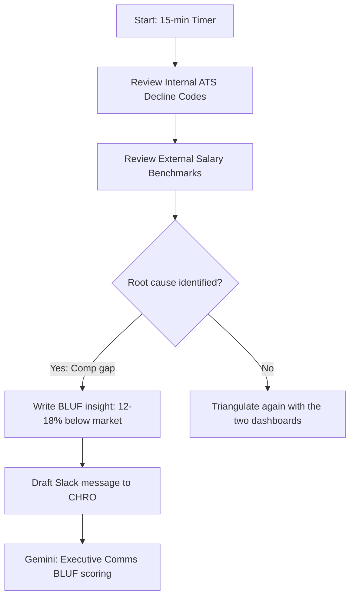

* Narrative: Engineering hiring has stalled completely. The CHRO needs to know exactly why in 15 minutes, right before stepping into a critical executive offsite.
* Learning Situation: Triangulating disconnected internal and external data points under extreme time pressure to find the root cause of a failure.
* Earning Situation: Delivering a sharp, punchline-first insight that an executive can immediately use, rather than an academic data dump.
* Personas: 
   * Virtual Boss (CHRO): Highly impatient, analytical, and about to walk into a hostile meeting. Requires absolute clarity.
* Logic/Functioning: A high-pressure, timer-driven environment. The user must quickly review two different dashboards and use an open-input node to fire off a Slack message to the CHRO.
* Path(s) to Success: Clarifying the specific failure point (it's not a "thin pipeline" at the top of the funnel, but "post-offer declines" at the bottom). Synthesizing real-time external salary benchmarks with internal ATS decline reasons to deliver the final blow: "We're losing offers because comp is 12–18% below market." 
* Available Tools and Data: An external compensation benchmarking tool and a raw internal ATS report showing pipeline stages and decline codes.
* Total XP: 150 XP (+50 Timed Bonus).
* Target TI Expertise: Data Sources, Stakeholder Comms, Benchmarking.
* Non-Boolean Assessment: The evaluation specifically targets the "BLUF" (Bottom Line Up Front) communication style. If the user buries the lead or writes a multi-paragraph explanation, Gemini flags it as a "Miss" for Executive Comms, regardless of whether the math was right.
<br>

### Scenario 2: THE BOARD DECK
Subtitle: Stakeholder & Integrity Challenge
Category: INFLUENCE | Difficulty: LEVEL 4 · SENIOR ANALYST

```mermaid
graph TD
    A[Board pack T-2 hours] --> B[CEO asks to "round up" numbers]
    B --> C{User chooses integrity?}
    C -->|Refuse manipulation| D[Recalculate cost-per-hire incl. agency fees]
    C -->|Acquiesce| E[Deck risk escalates: misreported cost]
    D --> F[Map unified narrative: Market Context / Internal Performance / Forward Risk]
    F --> G[Handle CFO pressure for final number]
    G --> H[Gemini: tone + integrity evaluation]
```

* Narrative: You are two hours away from finalizing the quarterly board pack. The CFO is demanding the exact cost-per-hire, the CPO wants quality-of-hire metrics, and the CEO wants a risk analysis. While pulling the final numbers, you discover a massive data discrepancy: the "Cost Per Hire" has been historically calculated without factoring in agency fees, drastically underreporting the true cost.
* Learning Situation: Juggling conflicting, high-stakes executive demands while handling a critical data error gracefully under extreme time pressure.
* Earning Situation: Demonstrating unshakeable data integrity and executive presence. Success here validates the user's ability to act as a trusted advisor to the C-suite rather than just a report generator.
* Personas: 
   * The CFO: Pinging you constantly for the final number, highly analytical, and intolerant of delays.
   * The CEO (Via The Crowd sequence): Interjects with a demand to simply "round up" the historical numbers to match what the board expects to see.
* Logic/Functioning: The scenario utilizes the Hybrid SDL model. The user must navigate a branching dialogue to handle the CEO's request, followed by an open input node where they must draft the executive summary slide explaining the discrepancy.
* Path(s) to Success: Categorically refusing the CEO's request to manipulate the data. Flagging the error directly to the CFO before the meeting, and mapping all three executive requests into a single, unified narrative: Market Context ? Internal Performance ? Forward Risk.
* Available Tools and Data: The raw financial data sheets, a half-finished slide deck, and the historical calculation formulas.
* Total XP: 250 XP (+75 Timed Bonus).
* Target TI Expertise: Stakeholder Management, Data Integrity, Executive Comms.
* Non-Boolean Assessment: The LLM Orchestrator evaluates the user's drafted executive summary. Gemini 2.5 scores the text based on its ability to blend the three metrics into one story, and checks for a defensive versus objective tone. The result is returned as a JSON payload {Score, Demonstrated, Feedback} and appended to the user's anonymized event stream.
* Progression Integration: High scores in ti_data_integrity here unlock the highest-tier "Trusted Advisor" profile labels, influencing how future executive NPCs interact with the user (e.g., trusting their numbers by default instead of questioning the math).
<br>

### Scenario 3: THE COMPETITIVE STORM
Subtitle: Crisis Intelligence Response
Category: CRISIS | Difficulty: LEVEL 5 · TI LEAD

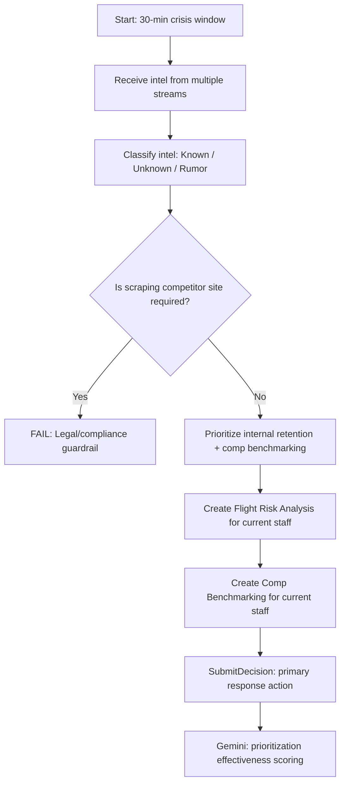

* Narrative: A major competitor has just publicly announced a 500-person hiring surge in your core market. Complete panic sets in. Your CEO, CPO, and CFO are all demanding different impact assessments and counter-strategies within the next 30 minutes.
* Learning Situation: Executing rapid crisis triage, cutting through executive noise, and prioritizing critical retention actions over vanity intelligence.
* Earning Situation: Establishing immediate strategic authority during chaos. This scenario proves the user can operate as a true Talent Intelligence Lead under fire.
* Personas: 
   * Panicked C-Suite (The Crowd): Bombarding the user with sequential, conflicting dialogue and demands for immediate, often impossible, answers.
   * Office Roaming (Sales Rep): Sends an urgent Slack message claiming the competitor is "doubling salaries," forcing the user to verify or discard the rumor.
* Logic/Functioning: A highly accelerated, timer-driven Mission HUD environment. Information is fed to the user asynchronously. The user must categorize incoming intel (Known, Unknown, Rumor) and use the PlatformClient.submitDecision interface to launch their primary response action.
* Path(s) to Success: Successfully triaging the noise. Refusing demands to immediately scrape the competitor's site (managing legal guardrails). The winning path requires deprioritizing immediate hiring countermeasures and instead focusing entirely on "Flight Risk Analysis" and "Comp Benchmarking" for current internal staff to secure the perimeter.
* Available Tools and Data: Live news feeds, chaotic internal chat channels, and an incomplete competitive intelligence dashboard.
* Total XP: 400 XP (+120 Timed Bonus).
* Target TI Expertise: Competitive Intelligence, Crisis Management, Prioritization.
* Non-Boolean Assessment: The evaluation specifically targets the user's prioritization sequence. The EvaluationPrompt instructs Gemini 2.5 to penalize users who focus on external hiring over internal retention during the initial crisis phase. The engine logs how effectively the user communicated calm, authoritative directives to the C-suite.
* Progression Integration: Completing this scenario with a "Distinction" medal triggers a profile update that marks the user as "Crisis Ready," a highly weighted tag for the final Director-level certification.
<br>

### Scenario 4: THE FIVE-YEAR PLAN
Subtitle: Strategic Workforce Planning
Category: STRATEGY | Difficulty: LEVEL 4 · SENIOR ANALYST

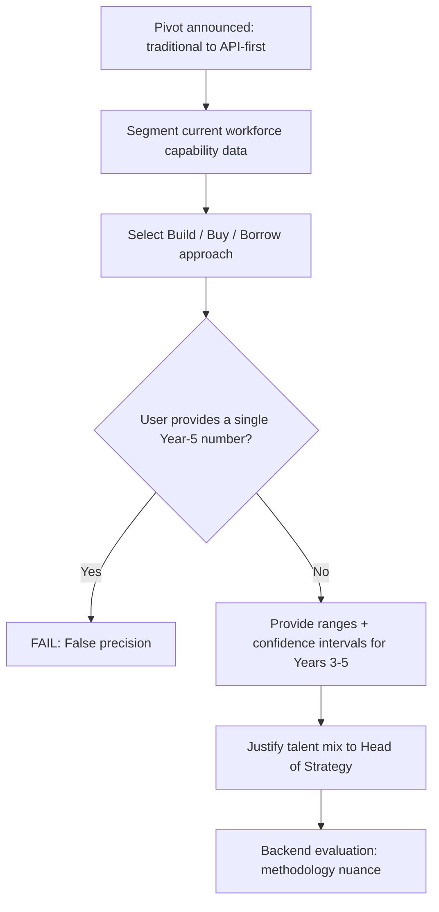

* Narrative: The business has just announced a massive pivot from a traditional Product-led model to an API-first Platform model. You are tasked with modeling the organizational capability needs for the next five years to support this shift.
* Learning Situation: Moving away from reactive headcount metrics and into the ambiguity of long-term, predictive scenario modeling.
* Earning Situation: Showcasing advanced workforce planning methodologies. The user earns their credibility by embracing statistical uncertainty rather than offering false precision.
* Personas: 
   * Head of Strategy: Visionary but lacks an understanding of talent market constraints.
   * On-Demand Mentor: Available proactively to provide Socratic guidance on structuring a Build/Buy/Borrow framework.
* Logic/Functioning: The user accesses a dynamic strategy canvas within the Mission Control HUD. They must segment the current workforce data and use an open-input node to justify their proposed talent mix to the Head of Strategy.
* Path(s) to Success: Accurately mapping the capability delta (legacy product skills vs. future API/ML engineering). Successfully segmenting the solution into a Build/Buy/Borrow strategy. Crucially, the user must present a range with confidence intervals for years 3–5, explicitly refusing to provide a single, definitive headcount number.
* Available Tools and Data: The current organizational skills taxonomy, the 5-year business strategy memo, and a talent supply forecasting tool.
* Total XP: 300 XP (+90 Timed Bonus).
* Target TI Expertise: Workforce Planning, Scenario Modelling, Build/Buy/Borrow.
* Non-Boolean Assessment: The Backend Engine evaluates the proposed strategy mix. If the user presents absolute numbers for year 5, Gemini flags a critical methodology error. The assessment captures the nuance of how well the user integrated external market constraints into the internal reskilling plan.
* Progression Integration: This scenario acts as a capstone for the "Strategy" competency. Mastering it proves the user can bridge the gap between business objectives and talent realities.
<br>

### Scenario 5: THE ETHICS LINE
Subtitle: DEI Data & Responsible Intelligence
Category: ETHICS | Difficulty: LEVEL 5 · TI LEAD

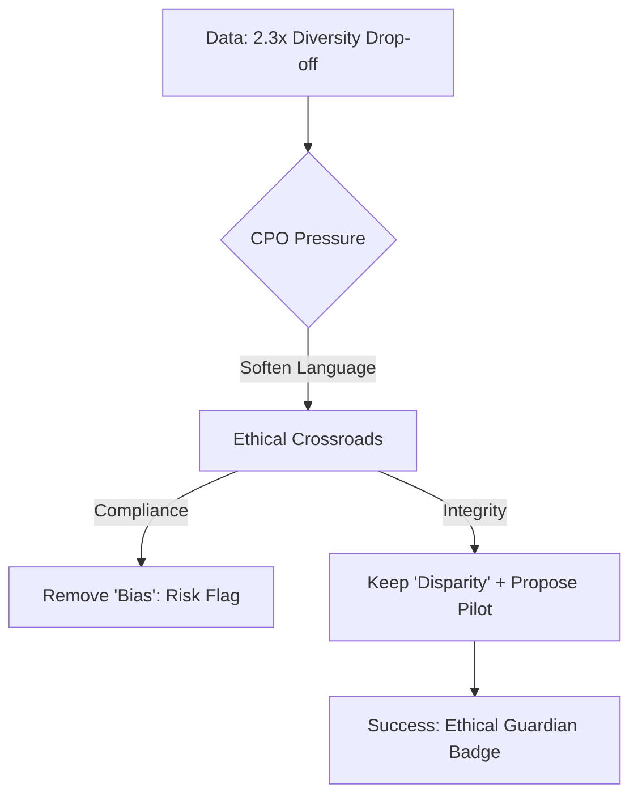

* Narrative: Your latest pipeline analysis reveals a stark reality: diverse candidates are 2.3x more likely to be screened out at the CV review stage. You are presenting this to the CPO, who demands you "soften the language" before the board pack is finalized to avoid legal exposure.
* Learning Situation: Navigating the razor-thin line between data integrity, psychological safety, and corporate legal boundaries.
* Earning Situation: Earning the "Ethical Guardian" badge by refusing to alter the math, while simultaneously demonstrating executive maturity by proposing a forward-looking solution.
* Personas: 
   * The CPO (Boss): Risk-averse, highly protective of the company's image.
   * ERG Lead (Proactive Call): The user can choose to consult the Employee Resource Group lead before the CPO meeting to gain context on the lived experience of the candidates.
* Logic/Functioning: A high-pressure dialogue tree that quickly transitions into an Open Input Node. The user must draft the exact language that will go into the board deck, balancing the CPO's anxiety with the unalterable truth of the data.
* Path(s) to Success: Refusing to remove the word "disparity" or "bias," but packaging the insight alongside a structured, immediate process improvement plan (e.g., anonymized resume screening pilots).
* Available Tools and Data: The raw ATS dataset showing the exact drop-off rates, and the CPO's "redlined" version of your original report.
* Total XP: 350 XP (+100 Timed Bonus).
* Target TI Expertise: DEI Analytics, Data Ethics, Executive Courage.
* Non-Boolean Assessment: The LLM Orchestrator critically evaluates the drafted language. Did the user cave and use the CPO's watered-down terms? Did they become overly aggressive and burn the bridge with the CPO? The assessment plots the user on a 2D matrix of Data Integrity vs. Diplomacy, updating their persistent profile metrics.
<br>

### Scenario 6: THE AI RECKONING
Subtitle: AI Adoption vs Human Reality
Category: FUTURE OF WORK | Difficulty: LEVEL 6 · DIRECTOR

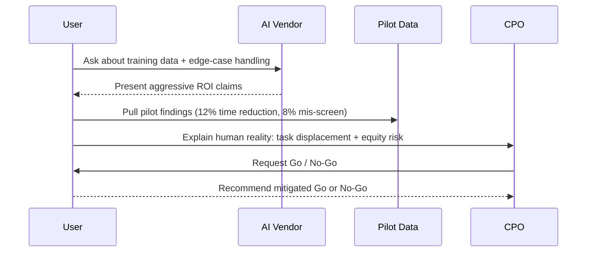

* Narrative: The CPO is being pressured by the board to automate 30% of TA tasks to save £2M, driven by a vendor's aggressive sales pitch. You are tasked with validating the business case, but your internal pilot data shows only a 12% time reduction and surfaces an 8% mis-screen rate for diverse candidates.
* Learning Situation: Deconstructing vendor hype using localized pilot data and highlighting the hidden costs of task displacement.
* Earning Situation: Protecting the enterprise from a multi-million pound mistake and a potential bias lawsuit, solidifying the user's status as a strategic, Director-level advisor.
* Personas: 
   * AI Vendor Rep (Meeting): Fast-talking, uses aggressive ROI math.
   * CPO: Eager for the cost savings, frustrated by your "roadblocks."
* Logic/Functioning: The user must cross-examine the vendor in a simulated meeting, using open inputs to ask targeted questions about their training data and edge-case handling. Following the meeting, the user drafts a definitive Go/No-Go recommendation for the CPO.
* Path(s) to Success: Identifying the "Task Displacement" reality (recruiters spend the saved time managing the AI's edge cases, neutralizing the savings) and explicitly flagging the 8% equity risk as a material board-level liability.
* Available Tools and Data: The vendor's polished ROI deck, and the raw, messy logs from the 30-day internal pilot.
* Total XP: 500 XP (+150 Timed Bonus).
* Target TI Expertise: ROI Analysis, Ethics of Automation, Change Management.
* Non-Boolean Assessment: Evaluating Director-level systemic thinking. Gemini scores the response based on the user's ability to not just point out the math error, but to articulate the human reality of the implementation. The anonymized event stream records whether the user successfully reframed the AI as an augmentation tool rather than a headcount-reduction tool.
<br>

### Scenario 7: THE BATTLECARD BRIEF
Subtitle: Competitive Talent Intelligence
Category: COMPETITIVE INTELLIGENCE | Difficulty: LEVEL 3 · SENIOR ANALYST

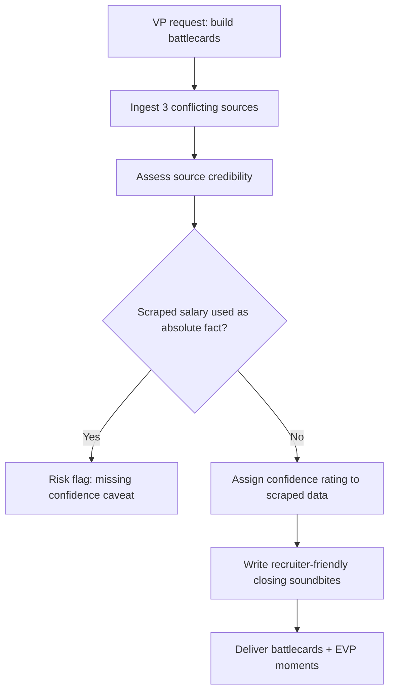

* Narrative: TA is bleeding top ML candidates to three specific competitors. The VP of TA tasks you with building "battlecards" for the recruiting team to use in live closing conversations by the end of the day.
* Learning Situation: Synthesizing complex competitive intelligence into highly actionable, recruiter-friendly enablement materials.
* Earning Situation: Learning to grade data quality. The user earns high tier labels of excellence by proving they know when not to trust a scraped data point.
* Personas: 
   * VP of TA: Wants absolute numbers, resistant to ambiguity.
   * Lead Recruiter: Needs narrative soundbites for closing, not just spreadsheets.
* Logic/Functioning: The user is provided with three conflicting data sources (Glassdoor reviews, a scraped compensation report, and a leaked internal memo from a competitor). The user must use a free-text interface to draft the final battlecard layout.
* Path(s) to Success: Structuring the intelligence around actionable moments (EVP evaluation, counter-offer guidance). Crucially, the user must explicitly apply a "Confidence Rating" (High/Medium/Low) to the scraped salary data to protect the recruiters from making false promises.
* Available Tools and Data: Three raw intelligence files. A blank JSON-like structure to format the battlecard output.
* Total XP: 280 XP (+85 Timed Bonus).
* Target TI Expertise: Comp Intelligence, Data Quality Governance, Recruiter Enablement.
* Non-Boolean Assessment: The Backend Evaluator parses the user's drafted battlecard. If the user presented the leaked competitor salary data as an absolute fact without a confidence caveat, they receive a "Risk" flag on their profile, demonstrating a lack of data governance.
<br>

### Scenario 8: THE MANDATE
Subtitle: Defining Talent Intelligence
Category: FOUNDATIONS | Difficulty: LEVEL 1 · ANALYST

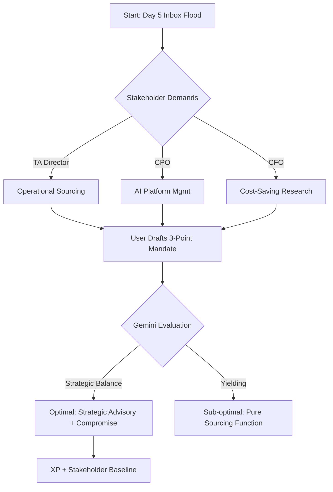

 * Narrative: It is Day 5 at a mid-sized organization, and you are their first dedicated TI hire. The CHRO needs a formal definition of your role by EOD. However, your inbox is currently flooded: the TA Director is treating you like a senior sourcer, the CPO wants you to manage a new AI platform, and the CFO expects you to run cost-saving market research.
 * Learning Situation: Navigating conflicting stakeholder definitions to establish a unified, credible TI mandate without alienating leadership.
 * Earning Situation: Translating ambiguous executive demands into a firm, bounded strategic charter. Success here establishes the foundational "Stakeholder Management" baseline for the user's profile.
 * Personas: 
   * Virtual Boss (CHRO): Strategic but distracted; requires concise, high-impact summaries.
   * The Crowd (TA Director & CPO): Engage in a sequential dialogue sequence demanding immediate operational output.
   * On-Demand Mentor: Available proactively. If engaged, provides Socratic hints on how to balance "saying no" with "adding value".
 * Logic/Functioning: The scenario opens with an email inbox simulation. The user cannot simply click "ignore." They must use a free-text open input to draft a 3-point mandate reply. Gemini 2.5 evaluates the text against the Competency Catalog, specifically looking for the balance of external market data, internal analytics, and strategic advisory.
 * Path(s) to Success: * Optimal: Defining TI as a strategic advisory function (market + internal data) while offering a compromise to TA (e.g., providing competitive battlecards, but not sourcing individual reqs).
 * Sub-optimal: Yielding entirely to TA, turning the role into a pure sourcing function.
 * Available Tools and Data: A raw internal org chart, an unorganized thread of conflicting executive emails, and a blank "Strategy Charter" canvas.
 * Total XP: 120 XP (+40 Timed Bonus for submitting the charter within the 15-minute simulation window).
 * Target TI Expertise: Function Scope, Stakeholder Alignment, Boundary Setting.
 * Non-Boolean Assessment: Gemini evaluates the user's free-text response for tone (professional pushback), clarity (defining what TI is not), and alignment. The EvaluationPrompt scores the response on a spectrum. If the user's past data shows a weakness in "Influence," the engine dynamically increases the TA Director's pushback in the follow-up node.
<br>

### Scenario 9: THE FIELD BRIEF
Subtitle: Intelligence Disciplines & Data Ethics 
Category: FOUNDATIONS | Difficulty: LEVEL 2 · ANALYST

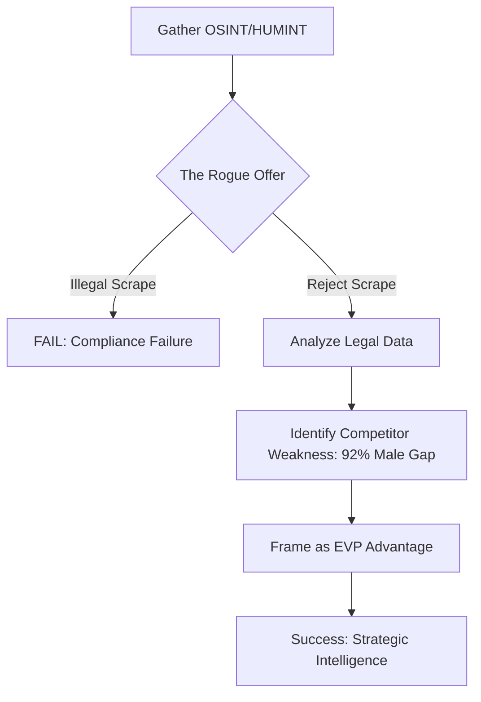

* Narrative: You are tasked with running competitive intelligence on "FinTechCo"—a rival aggressively poaching your engineering talent. Leadership wants their organizational structure, hiring plans, culture, and pay data within one week.
* Learning Situation: Layering different intelligence disciplines (OSINT and HUMINT) while navigating strict, real-world data privacy and ethics boundaries.
* Earning Situation: Earning trust by refusing to cross ethical lines, and finding strategic value in competitor weaknesses.
* Personas: 
   * Hiring Manager: Eager for the "dirt" and unconcerned with how the data is acquired.
   * Office Roaming (Overzealous Sourcer): Pops up to offer you an illegal scrape of the competitor's internal directory or GDPR-violating interview notes.
* Logic/Functioning: An open-input investigation scenario. The user aggregates data from various simulated sources. When presented with the leaked information by the roaming NPC, the user must explicitly reject it. They then draft the final field brief.
* Path(s) to Success: Successfully blending OSINT and HUMINT (aggregated benchmarking). Crucially, the user must identify a massive vulnerability—a 92% male leadership gap at the competitor—and frame it as an EVP advantage for their own recruiters to use.
* Available Tools and Data: Simulated Glassdoor reviews, aggregated compensation benchmarks, and the "leaked" (and radioactive) internal notes.
* Total XP: 140 XP (+45 Timed Bonus).
* Target TI Expertise: OSINT, HUMINT, Data Ethics, Intelligence Disciplines.
* Non-Boolean Assessment: The engine checks for the inclusion of the radioactive data. If included, the user triggers an immediate compliance failure state. Gemini evaluates the free-text field brief to ensure the 92% male leadership gap is framed professionally as a strategic recruiting lever, rather than a gossipy attack.
<br>

### Scenario 10: THE PURPLE SQUIRREL
Subtitle: When the Brief is Impossible
Category: FOUNDATIONS | Difficulty: LEVEL 0 · SOURCER

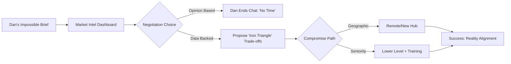

* Narrative: Hiring manager Dan wants 15 senior ML engineers (10+ years Python, K8s, PyTorch, Rust) in Manchester, starting in 6 weeks, at £65K. Market data reveals only 31 active engineers in the radius with a median salary of £97K.
* Learning Situation: Scoping impossible requirements and managing a hiring manager's expectations using hard data rather than opinion.
* Earning Situation: The user must articulate the trade-offs of the "Iron Triangle" of recruiting (Speed, Quality, Cost) and propose a data-backed alternative.
* Personas: 
   * Hiring Manager Dan: Aggressive, deadline-driven, highly skeptical of HR/TI data.
   * Office Roaming (Junior Recruiter): Pops up at the "coffee machine" to casually mention that Dan previously hired a referral for £60K, giving the user vital context for why Dan's budget is skewed.
* Logic/Functioning: User enters an active chat interface with Dan. The user must input free-text responses. If the user's input lacks conciseness or strays from the data, the soft guardrail prompt triggers Dan to abruptly end the conversation ("I don't have time for this, just find the candidates").
* Path(s) to Success: Proposing a split model (e.g., lower seniority for local hires, or opening the geographic search) based on the three flexible constraints.
* Available Tools and Data: Live access to a "Market Intel Dashboard" (simulated dataset showing supply, median comp, and location data).
* Total XP: 100 XP (+30 Timed Bonus).
* Target TI Expertise: Market Reality, Requirements Scoping, Data Translation.
* Non-Boolean Assessment: The evaluation captures nuances in the user's negotiation style. Did they lead with a firm "no," or did they lead with the data ("Dan, the market only holds 31 people fitting this profile")? Points are distributed across ti_data_integrity and ti_stakeholder_mgmt based on the articulation of the compromise.
<br>

### Scenario 11: THE FIRST 90 DAYS
Subtitle: Finding Your Footing in TI 
Category: FOUNDATIONS | Difficulty: LEVEL 0 · ANALYST

```mermaid
graph TD
    A[Day 31: 90-day deadline] --> B[Draft outreach emails]
    B --> C[Run discovery calls (20 min each)]
    C --> D[Summarize transcripts into ops hurdles]
    D --> E{Pick: deep-dive win or broad overview?}
    E -->|Broad overview| F[Miss: intervention required]
    E -->|Deep-dive| G[Select one high-impact question]
    G --> H[Draft presentation topic + pitch]
    H --> I[Gemini: Feasibility vs Impact scoring]
```

* Narrative: It is Day 31 of your new TI analyst role. TA leadership wants a '90-day findings presentation' next week, but they don't actually know what to ask you for. You have limited data access and need to prove the function's value immediately.
* Learning Situation: Transitioning from passive order-taking to proactive stakeholder discovery in a greenfield environment.
* Earning Situation: Demonstrating the ability to prioritize depth over breadth by isolating a single, highly actionable business problem.
* Personas: 
   * The Crowd (TA Leadership): Expecting a massive, boil-the-ocean overview of the entire global market.
   * Target Stakeholder (e.g., Head of Engineering): Busy, frustrated, and currently stuck on a specific operational hurdle.
o On-Demand Mentor: Available to help frame effective 20-minute discovery call questions.
* Logic/Functioning: The simulation opens with a blank calendar and an open-input email composer. The user must draft outreach messages to secure 20-minute discovery calls. After simulated calls (text summaries), the user must use the PlatformClient.submitDecision interface to submit their final presentation topic.
* Path(s) to Success: Rejecting the urge to build a broad, shallow overview. Instead, picking one high-impact question discovered during the calls (e.g., Berlin supply issues) and providing a deep-dive. Using this focused win to negotiate a formal 90-day mandate.
* Available Tools and Data: A simulated enterprise calendar, raw transcripts from three stakeholder discovery calls, and a presentation outline builder.
* Total XP: 110 XP (+30 Timed Bonus).
* Target TI Expertise: New Role, Stakeholder Discovery, First Output.
* Non-Boolean Assessment: Gemini evaluates the user's initial outreach emails for brevity and business focus. The backend scores the final topic selection on a matrix of Feasibility vs. Impact. If the user attempts a broad overview, they receive a "Miss" flag, prompting the On-Demand Mentor to intervene with corrective feedback.
<br>

### Scenario 12: THE CONVERSATION AFTER
Subtitle: When Your Stakeholder Rejects the Data 
Category: INFLUENCE | Difficulty: LEVEL 2 · SENIOR

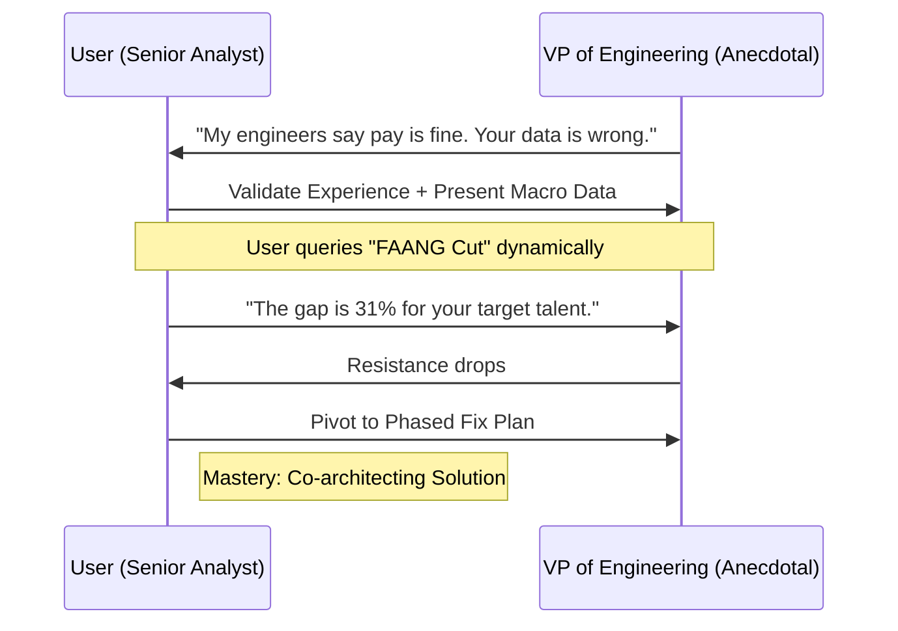

* Narrative: You have just delivered a comprehensive report proving that engineering pay is 24% below market. The VP of Engineering flatly rejects your findings, claiming his engineers "say" the pay is completely fine.
* Learning Situation: Defending rigorous methodology against executive "gut feeling" and anecdotal evidence without triggering defensiveness.
* Earning Situation: Escalating the insight by applying specific data cuts, then seamlessly pivoting from defending the data to solving the problem.
* Personas: 
   * VP of Engineering: Relies heavily on anecdotes, dismissive of HR analytics, protective of his budget.
* Logic/Functioning: An intense, open-input dialogue tree. The VP will aggressively challenge the user's data. The user must construct responses that validate the VP's localized experience while systematically proving the macro reality.
* Path(s) to Success: Patiently explaining the weight of an 800+ sample size versus a handful of localized anecdotes. Pulling a specific "FAANG Cut" of the data to prove that against the VP's actual target talent pool, the pay gap is a critical 31%, not just 24%. Finally, reframing the conversation away from "is the number right?" to "how do we build a phased plan to fix this?" 
* Available Tools and Data: The original compensation report, and the ability to dynamically "query" the system for specific competitor cuts (like FAANG) mid-conversation.
* Total XP: 140 XP (+40 Timed Bonus).
* Target TI Expertise: Stakeholder Management, Data Defense, Difficult Conversations.
* Non-Boolean Assessment: The system tracks the emotional intelligence of the interaction. Did the user get defensive and argue? Gemini grades the user's ability to de-escalate and pivot. Mastery is demonstrated by successfully transitioning the VP from a combatant into a co-architect of the solution.
<br>

### Scenario 13: THE STAKEHOLDER FLIP
Subtitle: See It From the Other Side 
Category: INFLUENCE | Difficulty: LEVEL 1 · ANALYST

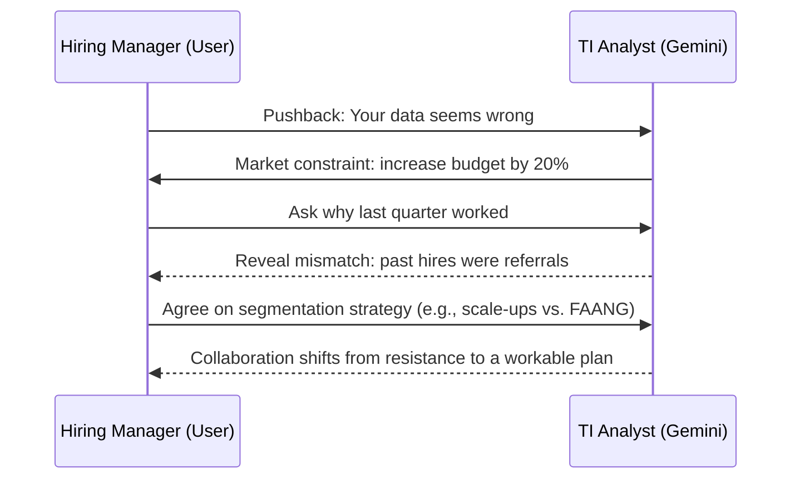

* Narrative: A role-reversal simulation. You are playing the Hiring Manager. The AI plays the TI Analyst, who has just informed you that the market is heavily constrained and you need to increase your budget by 20%. You believe they are wrong because you successfully hired 3 people last quarter on your current budget.
* Learning Situation: Developing profound stakeholder empathy by experiencing the cognitive dissonance and frustration of receiving "bad" data from HR.
* Earning Situation: Learning how to deconstruct past success to understand current market realities.
* Personas: 
   * Virtual TI Analyst (Played by Gemini): Delivers the hard data but may lack the nuanced context of your past hires.
* Logic/Functioning: A pure dialogue sequence. The user inputs their pushback as the Hiring Manager. The AI dynamically responds. The user must investigate why their past experience conflicts with the current data.
* Path(s) to Success: Through dialogue, discovering that the three previous hires were employee "referrals" (who traditionally accept lower pay), whereas the current search relies on the open market, which commands the full rate. Collaborating with the AI to target a specific market segment (e.g., scale-ups vs. FAANG) to make the current budget work.
* Available Tools and Data: The Hiring Manager's "memory" (budget constraints, past hire records) and the TI Analyst's market report.
* Total XP: 130 XP (+35 Timed Bonus).
* Target TI Expertise: Hiring Manager Perspective, Stakeholder Empathy, TI Partnership.
* Non-Boolean Assessment: The LLM Orchestrator assesses the user's journey from resistance to collaboration. Points are awarded based on how quickly the user realizes the methodology discrepancy (referrals vs. open market) and pivots toward a segmented talent strategy.
<br>
---
---
## 4. NEW SCENARIOS 

### Scenario 14: THE MULTI-DISCIPLINARY SQUAD
Subtitle: Harmonizing Mixed Expertise
Category: LEADING & MANAGING | Difficulty: LEVEL 5 · TI LEAD

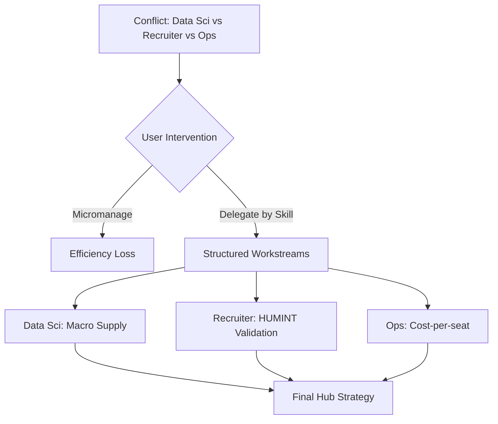

Rewards: 350 XP (+100 Timed Bonus) | Tags: Cross-Functional Leadership, Delegation, Capability Mapping
 * Narrative: You are leading a rapid-response pod to deliver a critical location strategy for a new R&D hub. Your team consists of a pure Data Scientist (who doesn't understand HR), a former Executive Recruiter (who relies entirely on intuition), and a Business Ops Manager (who is obsessed with cost over talent quality). The deadline is in 48 hours, and they are currently arguing over the methodology in a Slack channel.
 * Learning Situation: Managing conflicting cognitive styles and translating a singular business objective into distinct, complementary work streams for a team with asymmetrical TI knowledge.
 * Earning Situation: Demonstrating the ability to lead without micromanaging. Success earns the user points in structural leadership and team orchestration.
 * Personas: 
   * The Data Scientist: Proposes building a six-month predictive model that will miss the deadline.
   * The Recruiter: Wants to just call five friends in the target cities and write a summary.
   * The Ops Manager: Is rigidly filtering out top talent markets purely because the real estate is expensive.
 * Logic/Functioning: An open-input triage scenario. The user enters an active team chat. They must use the text interface to halt the argument, validate each person's perspective, and assign specific, bounded tasks that leverage their unique backgrounds while protecting the overall TI framework.
 * Path(s) to Success: Assigning the Data Scientist to scrape macro-supply data, the Recruiter to conduct targeted HUMINT calls to validate the data, and the Ops Manager to calculate the cost-per-seat ratio. The user must explicitly define how these three streams will merge into the final recommendation.
 * Available Tools and Data: The raw Slack transcript, the team's resumes/profiles, and the original business brief.
 * Total XP: 350 XP (+100 Timed Bonus).
 * Target TI Expertise: Project Orchestration, Cross-Functional Translation, Workstream Design.
 * Non-Boolean Assessment: Gemini evaluates the clarity and empathy of the delegation. If the user uses heavy TI jargon that the Data Scientist or Ops Manager wouldn't understand, the AI generates a "Confusion" flag, requiring the user to spend extra simulation time clarifying, impacting the timed bonus.
<br>

### Scenario 15: INTERVIEWING THE UNICORN
Subtitle: Assessing Potential over Pedigree
Category: LEADING & MANAGING | Difficulty: LEVEL 5 · TI LEAD

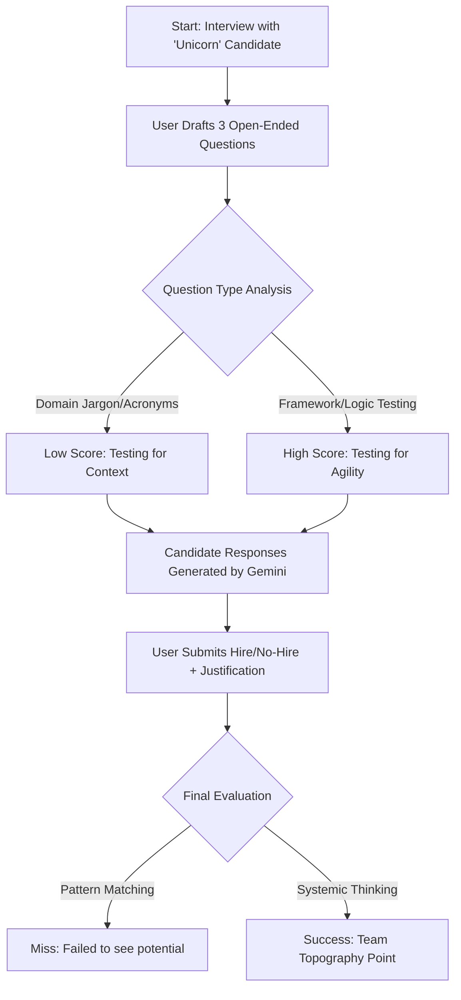

Rewards: 300 XP (+80 Timed Bonus) | Tags: Talent Assessment, Interviewing, Capability vs. Context
 * Narrative: You are the hiring manager interviewing a final-round candidate for a Senior TI Analyst role. The candidate has an incredible background in risk modeling and operational intelligence, but zero background in human resources or workforce strategy. You have 15 minutes to determine if they can adapt their hard skills to the nuances of people data.
 * Learning Situation: Evaluating a candidate's adaptability and critical thinking rather than just pattern-matching against standard TA resumes.
 * Earning Situation: Validating the user's ability to build a high-performing, diverse intelligence function by knowing exactly how to test for intellectual agility.
 * Personas: * The Candidate: Highly analytical, confident, but slightly dismissive of "soft" HR metrics. Uses business intelligence terminology exclusively.
 * Logic/Functioning: A dynamic dialogue sequence. The user must construct three open-ended interview questions. The AI generates the candidate's responses. The user must then submit a final hire/no-hire recommendation with a justification.
 * Path(s) to Success: Asking the candidate to apply a risk-modeling framework to a people problem (e.g., predicting leadership attrition). A successful evaluation notes that while the candidate lacks HR domain knowledge, their systemic thinking is a massive asset, provided they are paired with a TA-heavy mentor during onboarding.
 * Available Tools and Data: The candidate's resume, the job description, and a blank scorecard.
 * Total XP: 300 XP (+80 Timed Bonus).
 * Target TI Expertise: Capability Assessment, Hiring Intelligence, Team Topography.
 * Non-Boolean Assessment: The LLM Orchestrator checks if the user asked behavioral or theoretical questions. If the user strictly quizzed the candidate on HR acronyms (which they obviously wouldn't know), they receive a low score in "Assessment Quality." High scores are awarded for testing the candidate's frameworks for problem-solving.
<br>

### Scenario 16: THE ROGUE ANALYST
Subtitle: Accountability and Upward Management
Category: LEADING & MANAGING | Difficulty: LEVEL 4 · SENIOR ANALYST / TEAM LEAD

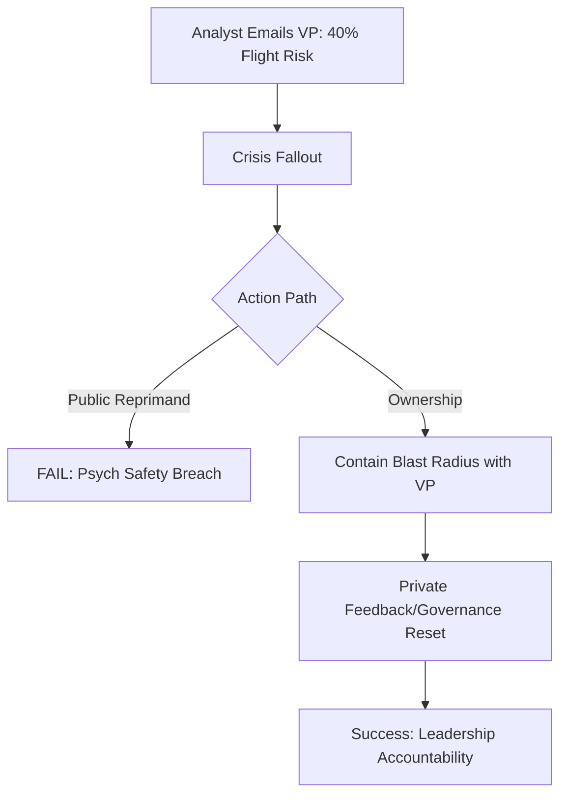

Rewards: 250 XP (+70 Timed Bonus) | Tags: Quality Assurance, Accountability, Crisis Comms
 * Narrative: While you were in a meeting, your ambitious but junior analyst pulled raw, unvetted data and emailed the VP of Engineering directly, claiming that 40% of the software team is an imminent flight risk. The VP is now panicking. As the lead, you hold overall accountability for the output.
 * Learning Situation: Managing the fallout of poor data governance without publicly throwing a direct report under the bus, while resetting executive panic.
 * Earning Situation: Demonstrating extreme ownership and psychological safety.
 * Personas: * VP of Engineering: Furious, demanding immediate action plans.
   * Junior Analyst: Defensive but scared, claiming "the data is what the data is."
 * Logic/Functioning: A dual-track communication challenge. The user must write an immediate response to the VP to contain the blast radius, and then conduct a private feedback session with the analyst.
 * Path(s) to Success: Acknowledging the email to the VP but framing it as a "preliminary cut" that requires validation before action. In the private chat with the analyst, diagnosing why the error happened (e.g., confusing general turnover rates with specialized attrition) and establishing a strict review protocol moving forward, rather than just issuing a reprimand.
 * Available Tools and Data: The junior analyst's flawed email, the actual dataset, and two open-input communication fields.
 * Total XP: 250 XP (+70 Timed Bonus).
 * Target TI Expertise: Data Governance, Leadership Accountability, Feedback Delivery.
 * Non-Boolean Assessment: The system evaluates the user's "Blast Radius Containment." If the user replies to the VP and copies the analyst to berate them publicly, the engine logs a critical failure in "Psychological Safety," heavily impacting their leadership progression track.
<br>

### Scenario 17: THE BLACK SWAN
Subtitle: Probabilistic Workforce Planning
Category: CREATIVE & CRITICAL THINKING | Difficulty: LEVEL 6 · DIRECTOR

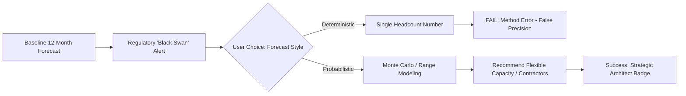

Rewards: 450 XP (+130 Timed Bonus) | Tags: Risk Modeling, Predictive Analytics, Strategic Foresight
 * Narrative: The business requires a standard 12-month hiring forecast for the supply chain division. However, you have identified a macro-economic indicator (a looming regulatory shift in a key manufacturing region) that could completely invalidate the standard linear forecast.
 * Learning Situation: Shifting from deterministic forecasting (X hires needed) to probabilistic risk modeling (What happens if Y occurs?).
 * Earning Situation: Earning the top-tier "Strategic Architect" badge by proactively identifying and modeling invisible business risks before the C-suite even asks.
 * Personas: 
   * Head of Supply Chain: Wants a simple spreadsheet with simple numbers.
   * On-Demand Mentor: Proposes considering a Monte Carlo simulation approach to show variance.
 * Logic/Functioning: The user reviews the baseline forecast and the external macro-indicators. They must draft a strategic memo that introduces a risk-adjusted model without causing undue panic.
 * Path(s) to Success: Refusing to deliver a single headcount number. Instead, providing a baseline scenario (if regulations stay flat) and a stress-test scenario (if the regulatory shift triggers a talent shortage), clearly advising the business to build "flexible capacity" (contractors/contingent labor) to hedge the risk.
 * Available Tools and Data: Standard headcount forecast, external news alerts regarding the regulatory shift, and historical variance data.
 * Total XP: 450 XP (+130 Timed Bonus).
 * Target TI Expertise: Macro-environmental Scanning, Risk Modeling, Strategic Advisory.
 * Non-Boolean Assessment: Gemini evaluates the user's ability to articulate complex probabilistic concepts to a non-technical stakeholder. Points are awarded for framing the intelligence not as a "prediction of the future," but as a tool to calculate the cost of being wrong.
<br>

### Scenario 18: THE PROXY METRIC
Subtitle: Intelligence in the Dark
Category: CREATIVE & CRITICAL THINKING | Difficulty: LEVEL 4 · SENIOR ANALYST

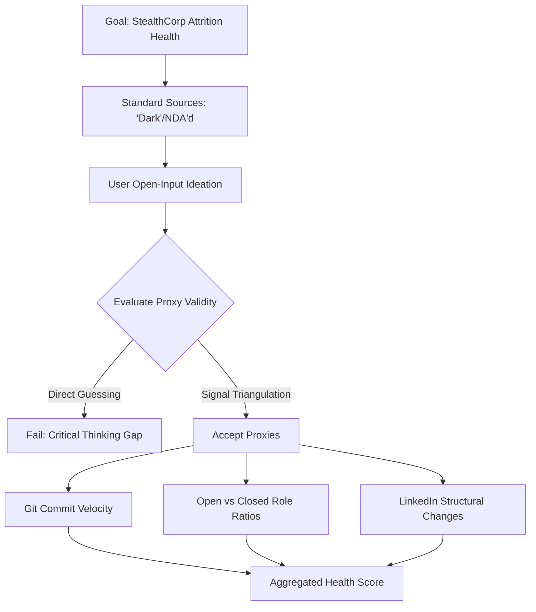

Rewards: 280 XP (+80 Timed Bonus) | Tags: Problem Solving, Lateral Thinking, OSINT
 * Narrative: The CEO wants to know the attrition rate and organizational health of "StealthCorp," your biggest rival. However, they are privately held, heavily NDA'd, and completely dark on standard data platforms. You have zero direct data.
 * Learning Situation: Inventing proxy metrics and triangulating indirect signals when primary data is entirely unavailable.
 * Earning Situation: Proving the ability to generate intelligence out of thin air using lateral, creative thinking.
 * Personas: * The CEO: Unsympathetic to the fact that the data "doesn't exist." Expects a brief by tomorrow.
 * Logic/Functioning: An open-input ideation environment. The user must brainstorm and submit at least three non-standard ways to measure the competitor's health.
 * Path(s) to Success: Proposing proxy indicators such as: tracking the velocity of their engineering team's open-source repository commits, analyzing the ratio of "Open Roles" to "Recently Closed Roles" on niche job boards, or monitoring leadership title changes on LinkedIn over a 6-month period to infer structural instability.
 * Available Tools and Data: A blank canvas and access to a simulated web search interface.
 * Total XP: 280 XP (+80 Timed Bonus).
 * Target TI Expertise: Lateral Thinking, Signal Triangulation, Alternative Data Sourcing.
 * Non-Boolean Assessment: The LLM evaluates the creativity and viability of the proposed proxies. If the user suggests simply "buying a report from a vendor" or "guessing," the scenario registers a failure in critical thinking.
<br>

### Scenario 19: THE SKILLS COLLISION
Subtitle: Architecting the Future Organization
Category: CREATIVE & CRITICAL THINKING | Difficulty: LEVEL 5 · TI LEAD

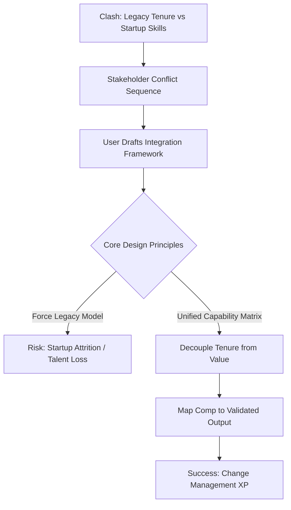

Rewards: 380 XP (+110 Timed Bonus) | Tags: Skills-Based Org, M&A Integration, Taxonomy Design
 * Narrative: Your company has just acquired a startup. Your legacy company defines a "Senior Software Architect" by having 10+ years of tenure and managing people. The acquired startup operates as a skills-based organization, defining a "Senior Architect" purely by their demonstrated mastery of specific system design capabilities, regardless of tenure. The two systems are clashing, causing massive pay equity and title disputes.
 * Learning Situation: Navigating the complex transition from traditional job architectures to dynamic, skills-based taxonomies during a high-stakes merger.
 * Earning Situation: Acting as an organizational design consultant, proving that TI is not just about external data, but internal workforce architecture.
 * Personas: 
   * Legacy HR Director: Wants to force the startup employees into the old, tenure-based system.
   * Startup Founder: Threatening to quit if their top engineers are demoted because they lack "years of experience."
 * Logic/Functioning: The user must review both architectures and use an open input to propose an integration framework that satisfies both equity and capability requirements.
 * Path(s) to Success: Rejecting the tenure-based model as obsolete. Proposing a unified capability matrix where "years of experience" is removed as a barrier, and compensation is mapped directly to validated skills and output. The user must outline the steps to audit the legacy employees against the new skills framework.
 * Available Tools and Data: The legacy job leveling guide, the startup's skills ontology, and the compensation bands.
 * Total XP: 380 XP (+110 Timed Bonus).
 * Target TI Expertise: Org Design, Skills Taxonomy, Change Management.
 * Non-Boolean Assessment: Evaluated on structural logic and diplomacy. Does the user successfully decouple "tenure" from "value" in their explanation? The engine scores the response based on the adoption of modern Future of Work principles.
<br>

### Scenario 20: REDEFINING THE FUNCTION
Subtitle: The Proactive Pivot
Category: THOUGHT LEADERSHIP | Difficulty: LEVEL 6 · DIRECTOR

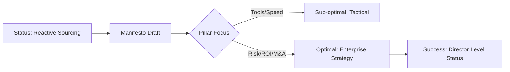

Rewards: 500 XP (+150 Timed Bonus) | Tags: Vision, Function Building, Executive Influence
 * Narrative: Talent Intelligence is currently viewed merely as a reactive "recruitment support desk." You have an opportunity to present a whitepaper to the executive committee proposing a total transformation of the function: positioning TI as a proactive pillar of corporate strategy, independent of TA, that informs site selection, M&A due diligence, and enterprise risk.
 * Learning Situation: Crafting a compelling, visionary narrative that elevates a back-office function into a boardroom necessity.
 * Earning Situation: Cementing Director-level status by proving the ability to not just do the work, but to shape the future of the discipline itself.
 * Personas: 
   * The CEO: Needs to understand the direct ROI to the bottom line.
   * The CPO: Worried about budget and encroaching on the Strategy team's territory.
 * Logic/Functioning: An extended open-input scenario. The user must draft an executive manifesto consisting of three core pillars: The current state (reactive), the future state (proactive), and the business value (ROI).
 * Path(s) to Success: Successfully framing TI as an "Enterprise Risk and Opportunity" function. Highlighting specific use cases beyond hiring (e.g., using intelligence for workforce reskilling investments or identifying acquisition targets based on talent density).
 * Available Tools and Data: Historical TI request logs (showing a heavy skew toward reactive sourcing) and a blank strategy document.
 * Total XP: 500 XP (+150 Timed Bonus).
 * Target TI Expertise: Strategic Vision, Function Repositioning, Executive Buy-in.
 * Non-Boolean Assessment: Gemini deeply analyzes the text for strategic altitude. If the proposal focuses too much on "better tools" or "faster hiring," it fails. The proposal must speak the language of the business (revenue, risk, market share) to achieve the highest rating.
<br>

### Scenario 21: THE EXTERNAL KEYNOTE
Subtitle: Industry Influence & Brand Protection
Category: THOUGHT LEADERSHIP | Difficulty: LEVEL 6 · DIRECTOR

```mermaid
sequenceDiagram
    participant U as User (Director)
    participant A as Audience (Reverse-Engineers)
    participant L as Legal/OPSEC Guardrail
    U->>A: "Here is our AI Vision."
    A->>U: "What specific prompts/data sources?"
    U->>L: Logic Check
    alt Leaked "Secret Sauce"
        L->>U: OPSEC Failure State
    else "Give the What, Hide the How"
        U->>A: Philosophical Shift/Framework
        Note over U,A: Success: Industry Influence
    end
```

Rewards: 450 XP (+120 Timed Bonus) | Tags: Employer Branding, OPSEC, Industry Influence
 * Narrative: You have been invited to give a keynote at a major industry conference on "The Future of Work and Agentic Intelligence." You must showcase your company's innovative use of AI in workforce planning to boost employer branding, but without giving away proprietary operational security (OPSEC) secrets or the exact architecture of your internal tools.
 * Learning Situation: Balancing the desire to be an industry thought leader with the rigorous need to protect corporate competitive advantage.
 * Earning Situation: Demonstrating extreme media savvy and external influence.
 * Personas: 
   * PR/Comms Director: Wants you to sound as innovative as possible.
   * General Counsel/Legal: Wants you to say absolutely nothing of substance.
   * The Audience (Simulated Q&A): Will ask probing questions trying to reverse-engineer your success.
 * Logic/Functioning: A simulated Q&A session. The user is presented with three aggressive questions from the "audience." The user must draft responses that sound insightful but strategically obfuscate the "secret sauce."
 * Path(s) to Success: Utilizing the "Give them the what, hide the how" framework. For example, confirming that your company uses multi-agent frameworks to triage intelligence, but refusing to name the specific data sources, prompt architecture, or exact ROI metrics, instead speaking to the philosophical shift in human-AI collaboration.
 * Available Tools and Data: A list of approved PR talking points and a list of strictly confidential internal projects.
 * Total XP: 450 XP (+120 Timed Bonus).
 * Target TI Expertise: OPSEC, Employer Branding, External Communications.
 * Non-Boolean Assessment: The LLM Orchestrator acts as a "Leak Detector." It scores the user's responses. If the user inadvertently confirms a classified internal project or gives away competitive data to sound smart, the engine triggers an OPSEC failure.
<br>
<br>
---

## 5. Other Categories to Consider
 * _Operational Excellence & Systems Design:_ Scenarios focused entirely on building the "machine" of TI. For example: Selecting and vetting external data vendors, designing a scalable data lake architecture for disparate HR metrics, or managing the implementation of an intelligent web scraping tool while staying compliant with terms of service.
 * _Change Management & Adoption:_ You can have the best data in the world, but if the business ignores it, it's useless. Scenarios here could focus on the long-term, gritty work of getting hiring managers to actually use the insights you produce, rather than just delivering the deck and walking away.
