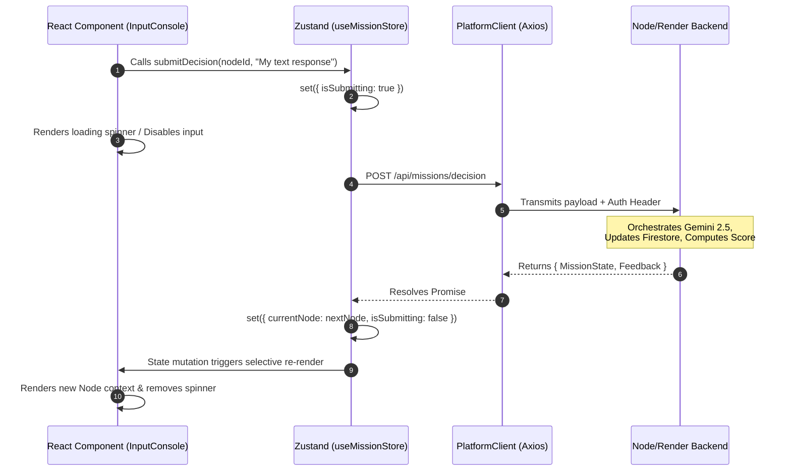

# React frontend state management and API integration.

The React frontend for TIC Trainer V2 is designed to be a "dumb" visual console, meaning it holds no authoritative simulation state. However, the transient UI state—managing the countdown timers, queuing the sequential NPC dialogues, and handling the loading skeletons while the LLM processes—is highly complex.

For a "high-stakes 'Mission Control' environment", Zustand will be applied over React Context. 

**Why Zustand?** Context triggers a re-render for every consuming component whenever any part of the state changes. If you have a ticking 15-minute timer firing every second in Context, your entire HUD will re-render continuously. Zustand allows components to selectively bind only to the specific state slices they need.


## The State Architecture: Zustand useMissionStore

The Zustand store acts as the localized cache for the MissionState returned by the Render backend, while also managing the UI-specific transient state (like whether the AI is currently "typing").

```TypeScript
import { create } from 'zustand';
import { PlatformClient } from '../api/PlatformClient'; // Your Axios/Fetch wrapper

interface MissionStore {
  // --- 1. Authoritative State (Mirrors Backend) ---
  sessionId: string | null;
  currentNode: NodeContext | null;
  profileMetrics: ProfileMetrics | null;
  isTerminal: boolean;

  // --- 2. Transient UI State ---
  isSubmitting: boolean;      // True while waiting for Gemini to score the input
  isNpcTyping: boolean;       // For the Agentic Social Engine delay
  activeSocialQueue: any[];   // Queued messages from "The Crowd" or "Office Roaming"
  timeRemaining: number;      // Local timer for the Timed Bonus

  // --- 3. Actions (Async & Sync) ---
  initializeMission: (scenarioId: string) => Promise<void>;
  submitDecision: (nodeId: string, input: string | any) => Promise<void>;
  requestMentorHint: (currentChallenge: string) => Promise<void>;
  decrementTimer: () => void;
}

export const useMissionStore = create<MissionStore>((set, get) => ({
  sessionId: null,
  currentNode: null,
  profileMetrics: null,
  isTerminal: false,
  isSubmitting: false,
  isNpcTyping: false,
  activeSocialQueue: [],
  timeRemaining: 900, // e.g., 15 minutes in seconds

  initializeMission: async (scenarioId) => {
    set({ isSubmitting: true });
    try {
      const response = await PlatformClient.startMission(scenarioId);
      set({ 
        sessionId: response.sessionId, 
        currentNode: response.currentNode,
        isSubmitting: false 
      });
    } catch (error) {
      // Handle error boundary
      set({ isSubmitting: false });
    }
  },

  submitDecision: async (nodeId, input) => {
    set({ isSubmitting: true });
    try {
      const response = await PlatformClient.submitDecision({
        sessionId: get().sessionId!,
        nodeId,
        input
      });
      
      // Update the authoritative state with the backend's response
      set({ 
        currentNode: response.MissionState.currentNode,
        profileMetrics: response.MissionState.profileMetrics,
        isTerminal: response.MissionState.isTerminal,
        isSubmitting: false 
      });

      // If the backend returns feedback or sequential NPC dialogue, push it to the UI queue
      if (response.Feedback) {
          // Logic to handle NPC response rendering
      }

    } catch (error) {
      set({ isSubmitting: false });
    }
  },

  requestMentorHint: async (challenge) => { /* Similar async flow */ },
  decrementTimer: () => set((state) => ({ timeRemaining: state.timeRemaining - 1 })),
}));
```

For exact request/response shapes, error codes, and idempotency rules, see [`API_CONTRACTS_PLATFORMCLIENT.md`](../../02_Contracts/01_API_and_State/API_CONTRACTS_PLATFORMCLIENT.md) and [`SESSION_AND_NODE_STATE_MACHINE.md`](../../02_Contracts/01_API_and_State/SESSION_AND_NODE_STATE_MACHINE.md).

### Component Consumption (The Mission HUD)

With Zustand, the React components in the MissionHUD subscribe only to the slices of state they care about. This isolates rendering performance:

- NarrativeRender.tsx: Subscribes only to currentNode.sceneText.
- InputConsole.tsx: Subscribes to submitDecision and isSubmitting to disable the submit button and show a loading spinner while the backend's LLM Orchestrator processes the free-text evaluation.
- MissionTimer.tsx: Subscribes only to timeRemaining. Uses a local useEffect to call decrementTimer every second. Because of Zustand, this ticking timer will not cause the InputConsole or NarrativeRender to re-render.
- AgenticSocialFeed.tsx: Subscribes to activeSocialQueue and isNpcTyping to render the proactive calls from the Mentor or aggressive chats from Hiring Manager Dan.


## State Flow Visualization

The React UI interacts with the Zustand Store and the Render Backend API during an open-input evaluation.




## Handling Auth State (Firebase)

Because we are using Firebase Auth, authentication state sits slightly outside the MissionStore. It is best handled by a lightweight React Context or a separate Zustand useAuthStore that wraps the application. The PlatformClient (the Axios or native Fetch wrapper) should intercept every outgoing request to attach the current Firebase JWT.

```TypeScript
// Inside your PlatformClient configuration
import { getAuth } from "firebase/auth";

apiClient.interceptors.request.use(async (config) => {
  const user = getAuth().currentUser;
  if (user) {
    const token = await user.getIdToken();
    config.headers.Authorization = `Bearer ${token}`;
  }
  return config;
});
```
