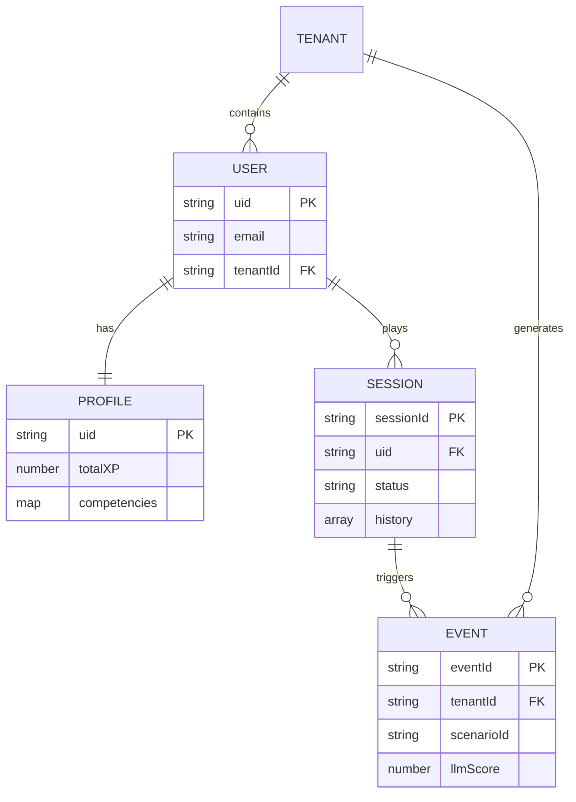

```mermaid
erDiagram
    TENANT ||--o{ USER : contains
    USER ||--|| PROFILE : has
    USER ||--o{ SESSION : plays
    TENANT ||--o{ EVENT : generates
    SESSION ||--o{ EVENT : triggers

    USER {
        string uid PK
        string email
        string tenantId FK
    }
    PROFILE {
        string uid PK
        number totalXP
        map competencies
    }
    SESSION {
        string sessionId PK
        string uid FK
        string status
        array history
    }
    EVENT {
        string eventId PK
        string tenantId FK
        string scenarioId
        number llmScore
    }
```
