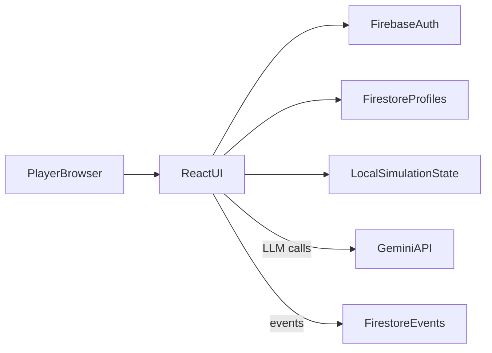
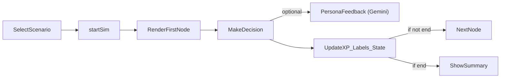

### ATTENTION!!

***See FULL_FINAL_BLUEPRINT.md for more up-to-date and comprehemnsive info.This document only covers index.html ==> The plan greatly matured since then*** 

## TI Certification Simulation Platform (V2)

Advanced MVP version of a console-style simulation platform for Talent Intelligence, Workforce Planning, and People Analytics practitioners. Users play through realistic missions, interact with AI personas, and accumulate XP and labels of excellence that reflect sustained capability rather than a one-off exam.

The prototype implementation was built from was a client-first React app embedded in `index.html`, backed by Firebase Auth/Firestore and Gemini for mentor feedback and optional TTS.

---
### Platform Data Flow

The diagram below shows how data moves through the system at runtime.

- **PlayerBrowser**: the user’s browser running the TI Simulation Console (`index.html`).
- **ReactUI**: the React app that renders missions, decisions, rank, and the admin console.
- **FirebaseAuth**: anonymous authentication that assigns each player a stable UID.
- **FirestoreProfiles**: stores per-user XP, completed scenarios, and labels of excellence.
- **LocalSimulationState**: in-memory state for the current mission (current node, history, feedback).
- **GeminiAPI**: provides persona-conditioned mentor feedback and optional text-to-speech audio.
- **FirestoreEvents**: append-only stream of mission events (start, decisions, completion) used for analytics.

---
### Functional Simulation Flow (index.html)

This diagram describes the functional steps when a user plays a mission.

1. **SelectScenario**: the user chooses a mission from the dashboard or mission log.
2. **startSim**: the app resets mission state, optionally plays TTS for the opening scene, and logs a `mission_start` event.
3. **RenderFirstNode**: the first narrative node and its choices are displayed.
4. **MakeDecision**: the user selects a choice; the app records the decision in local history.
5. **PersonaFeedback (Gemini)** (optional): if the mentor persona module is enabled, Gemini critiques the decision in the active persona’s voice.
6. **UpdateXP_Labels_State**: XP, completion flags, and labels of excellence are updated; profile and label data are persisted if the user is authenticated.
7. **NextNode vs ShowSummary**:
   - If the mission is not over, the next node is rendered (with optional TTS) and the loop continues.
   - If the mission ends, a summary screen is shown and a `mission_complete` event is logged.

For a deeper architectural breakdown, refer to the current architecture set in `Pre_Build Documents` (the legacy `ARCHITECTURE.md` and `TI-PLATFORM-PLAN.md` references are intentionally retired).

---

## Talent Intelligence Professional Console (index.html)

1. Project Overview

The Talent Intelligence (TI) Professional Console is an immersive, AI-driven training environment designed to calibrate the decision-making quality of Talent Intelligence practitioners. It transforms theoretical TI frameworks into a high-stakes "Mission Control" simulation where every choice has a quantified business impact.

2. Historical Context

The Origins: The .jsx Era

The project originated as a static React component (ti-training-group-v11.jsx) authored by Toby Culshaw.

Original Core: It served as a robust decision-tree engine containing 13 distinct scenarios ranging from foundational definitions to executive AI strategy.

The Transition: The current iteration has refactored this foundational logic into a single-file, mobile-responsive HTML application. While the original scenario data remains the "brain" of the experience, the interface has shifted from a vertical list-based UI to a non-linear SVG Career Pathway.

3. Data Flow & Architecture (index.html)

The console operates on a three-tier architecture:

A. Intelligence Layer (Gemini 2.5)
- Strategic Evaluation: Every decision is sent to the gemini-2.5-flash-preview-09-2025 model. The AI doesn't just check if a choice is "right"; it evaluates the strategic nuance and returns a score (0-100).
- Multimodal Feedback: gemini-2.5-flash-preview-tts provides real-time voice-overs for stakeholders, increasing psychological immersion.
- Performance Memos: Post-mission, the AI generates a business impact summary based on the user's specific performance history.
  
B. Persistence Layer (Firebase Firestore)
- Identity Gating: * Professional Accounts: Authenticated via Google. Data is persisted in /artifacts/{appId}/users/{userId}/profile.
- Guest Access: Authenticated anonymously. Achievement data is volatile and session-bound
- Career Progress: Firestore tracks xp, completedScenarios, and the highPerformanceCount used for fast-tracking.

C. UI Layer (React & Tailwind)
- Responsive Engine: A mobile-first design that adapts from a sidebar-based desktop console to a bottom-nav mobile interface.
- Visual Pathway: A dynamic SVG tree that gates access to scenarios based on user maturity and performance scores.
